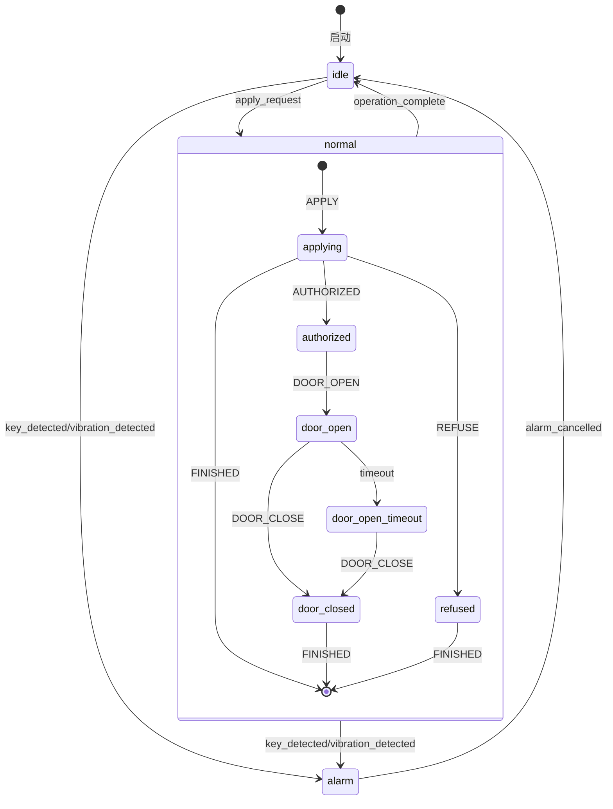
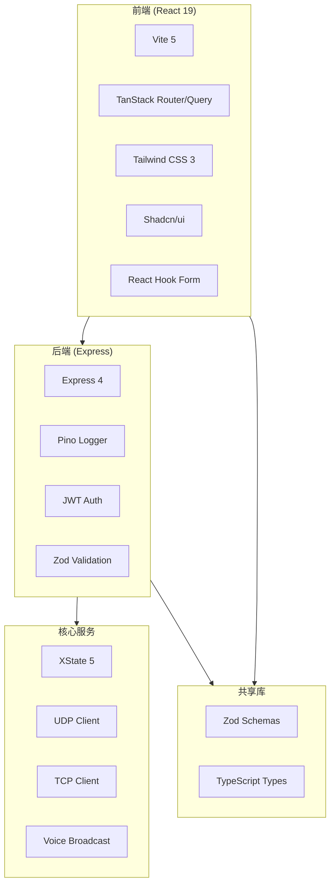

# Node Switch 项目架构文档

> **生成日期**: 2025-12-26
> **扫描模式**: 完全扫描 (exhaustive)
> **仓库类型**: Monorepo

---

## 1. 项目概述

**Node Switch** 是一个基于 Node.js + TypeScript 的硬件通信服务系统，用于继电器控制和语音播报。项目采用 monorepo 架构，包含 4 个主要部件。

### 核心功能

| 功能 | 描述 |
|------|------|
| **UDP 通信** | 与柜体端、控制端等设备通信 |
| **继电器控制** | 8路继电器开闭、延时控制、状态查询 |
| **语音播报** | CX-815E 语音模块集成，支持 TTS 播报 |
| **状态轮询** | 自动轮询设备状态并记录变化 |
| **配置管理** | Web UI 配置系统参数 |

---

## 2. 项目结构

### 2.1 仓库结构

```
node-switch/                    # Monorepo 根目录
├── packages/
│   ├── frontend/               # React 前端应用
│   ├── backend/                # Express API 后端
│   └── shared/                 # 共享类型和验证
├── src/                        # 核心硬件控制服务
├── docs/                       # 项目文档
├── config/                     # 配置文件
├── test/                       # 测试文件
└── scripts/                    # 构建脚本
```

### 2.2 部件分类

| 部件 | 类型 | 路径 | 技术栈 | 描述 |
|------|------|------|--------|------|
| **Core** | Embedded | `src/` | XState + UDP/TCP | 硬件通信核心服务 |
| **Frontend** | Web | `packages/frontend/` | React 19 + Vite + TanStack | 配置管理前端 |
| **Backend** | Backend | `packages/backend/` | Express + JWT + Pino | REST API 服务 |
| **Shared** | Library | `packages/shared/` | TypeScript + Zod | 共享验证逻辑 |

---

## 3. 核心硬件服务 (src/)

### 3.1 目录结构

```
src/
├── index.ts                    # 应用入口
├── business-logic/             # 业务逻辑
│   └── relay-status-aggregator.ts
├── config/                     # 配置管理 (Zod 校验)
├── hardware/                   # 硬件通信管理器
│   ├── manager.ts              # UDP/TCP 通信管理
│   └── initializer.ts          # 硬件初始化
├── state-machines/             # XState 状态机
│   ├── main-machine.ts         # 主状态机
│   ├── apply-ammo-machine.ts   # 供弹流程状态机
│   ├── monitor-machine.ts      # 监控状态机
│   └── alarm-machine.ts        # 报警状态机
├── relay/                      # 继电器控制
│   ├── controller.ts           # 命令构建器
│   ├── reset.ts                # 继电器重置
│   └── validation.ts           # 继电器验证
├── voice-broadcast/            # 语音播报
│   ├── index.ts                # 控制器
│   ├── initializer.ts          # 初始化
│   └── types.ts                # 类型定义
├── udp/                        # UDP 客户端
├── tcp/                        # TCP 客户端
├── logger/                     # Pino 日志封装
└── types/                      # 类型定义
```

### 3.2 状态机架构



### 3.3 硬件通信

**HardwareCommunicationManager** 提供统一的硬件通信接口：

- **UDP 客户端**: 与柜体端/控制端通信 (端口 8000)
- **TCP 客户端**: 与语音播报模块通信 (端口 50000)
- **支持多客户端**: 可同时管理多个 UDP/TCP 连接

---

## 4. 前端应用 (packages/frontend/)

### 4.1 技术栈

| 技术 | 版本 | 用途 |
|------|------|------|
| React | 19.0.0 | UI 框架 |
| Vite | 5.2.0 | 构建工具 |
| TanStack Router | 1.31.15 | 路由管理 |
| TanStack Query | 5.28.9 | 数据获取 |
| Tailwind CSS | 3.4.17 | 样式 |
| Shadcn/ui | - | UI 组件库 |
| React Hook Form | 7.69.0 | 表单管理 |
| Zod | 4.2.1 | 表单验证 |

### 4.2 目录结构

```
packages/frontend/src/
├── main.tsx                    # 应用入口
├── routes/                     # TanStack Router 路由
│   ├── __root.tsx              # 根布局
│   ├── _auth.tsx               # 认证保护布局
│   ├── _auth.index.tsx         # 仪表盘首页
│   └── login.tsx               # 登录页
├── components/
│   ├── dashboard/              # 仪表盘组件
│   │   ├── ConfigForm.tsx      # 配置表单
│   │   ├── AppConfigCard.tsx   # 应用配置卡片
│   │   └── NetworkConfigCard.tsx # 网络配置卡片
│   ├── layout/                 # 布局组件
│   ├── system/                 # 系统组件 (重启按钮等)
│   └── ui/                     # Shadcn UI 组件 (14个)
├── hooks/                      # 自定义 Hooks
│   ├── useUpdateConfig.ts      # 配置更新
│   └── useImportExportConfig.ts # 配置导入导出
├── contexts/                   # React Context
├── api/                        # API 客户端
├── lib/                        # 工具函数
└── services/                   # 服务层
```

### 4.3 路由结构

| 路由 | 组件 | 保护 | 描述 |
|------|------|------|------|
| `/login` | login.tsx | 公开 | 登录页面 |
| `/` | _auth.index.tsx | 需认证 | 仪表盘首页 |

---

## 5. 后端 API (packages/backend/)

### 5.1 技术栈

| 技术 | 版本 | 用途 |
|------|------|------|
| Express | 4.21.2 | Web 框架 |
| Pino | 10.1.0 | 日志 |
| JWT | 9.0.3 | 认证 |
| Zod | 4.2.1 | 验证 |
| XState | 5.12.1 | 状态管理 |

### 5.2 目录结构

```
packages/backend/src/
├── index.ts                    # 应用入口
├── server.ts                   # Express 配置
├── routes/                     # API 路由
│   ├── auth.routes.ts          # 认证路由
│   ├── config.routes.ts        # 配置 CRUD
│   ├── status.routes.ts        # 状态查询
│   ├── system.routes.ts        # 系统操作
│   └── conflict-detection.routes.ts # 冲突检测
├── services/                   # 业务服务
│   ├── config.service.ts       # 配置服务
│   ├── config-import-export.service.ts # 导入导出
│   ├── restart.service.ts      # 重启服务
│   ├── conflict-detection.service.ts # 冲突检测
│   ├── connection-test.service.ts # 连接测试
│   └── status.service.ts       # 状态服务
├── middleware/                 # 中间件
│   └── auth.middleware.ts      # JWT 认证
└── utils/                      # 工具函数
    └── logger.ts               # Pino 日志
```

### 5.3 API 端点

| 方法 | 路径 | 认证 | 描述 |
|------|------|------|------|
| POST | `/api/auth/login` | 公开 | 用户登录 |
| GET | `/api/config` | 需认证 | 获取配置 |
| PUT | `/api/config` | 需认证 | 更新配置 |
| GET | `/api/config/export` | 需认证 | 导出配置 |
| POST | `/api/config/import` | 需认证 | 导入配置 |
| GET | `/api/config/check-conflict` | 需认证 | 冲突检测 |
| GET | `/api/status` | 需认证 | 系统状态 |
| POST | `/api/system/restart` | 需认证 | 重启系统 |
| GET | `/health` | 公开 | 健康检查 |

---

## 6. 共享库 (packages/shared/)

### 6.1 导出内容

**Schemas (Zod 验证)**:
- `configSchema` - 配置验证
- `networkConfigSchema` - 网络配置验证
- `deviceStatusSchema` - 设备状态验证
- `apiResponseSchema` - API 响应验证
- `loginRequestSchema` - 登录请求验证
- `testConnectionRequestSchema` - 连接测试验证
- `conflictDetectionRequestSchema` - 冲突检测验证

**Types**:
- `Config` - 配置类型
- `NetworkConfig` - 网络配置类型
- `DeviceStatus` - 设备状态类型
- `ApiResponse` - API 响应类型

---

## 7. 开发指南

### 7.1 环境要求

- Node.js >= 22.0.0
- pnpm (推荐)

### 7.2 快速开始

```bash
# 安装依赖
pnpm install

# 开发模式
pnpm dev

# 构建
pnpm build

# 测试
pnpm test
```

### 7.3 单独运行各包

```bash
# 前端
pnpm --filter frontend dev

# 后端
pnpm --filter backend dev

# 共享库构建
pnpm --filter shared build
```

### 7.4 环境配置

复制 `.env.example` 为 `.env` 并配置:

```bash
# 硬件通信 - 柜体端
CABINET_TARGET_HOST=192.168.1.101
CABINET_TARGET_PORT=8000

# 硬件通信 - 控制端
CONTROL_TARGET_HOST=192.168.1.102
CONTROL_TARGET_PORT=8000

# 语音播报模块
VOICE_BROADCAST_HOST=192.168.1.103
VOICE_BROADCAST_PORT=50000

# 轮询间隔 (ms)
QUERY_INTERVAL=1000
```

---

## 8. 部署

### 8.1 Systemd 服务

```bash
# 构建并部署
pnpm build
sudo mkdir -p /opt/node-switch
sudo cp -r dist package.json pnpm-lock.yaml .env /opt/node-switch/
cd /opt/node-switch && sudo pnpm install --prod

# 安装服务
sudo cp config/node-switch.service /etc/systemd/system/
sudo systemctl daemon-reload
sudo systemctl enable --now node-switch
```

### 8.2 服务管理

```bash
sudo systemctl start node-switch    # 启动
sudo systemctl stop node-switch     # 停止
sudo systemctl restart node-switch  # 重启
sudo systemctl status node-switch   # 状态
journalctl -u node-switch -f        # 日志
```

---

## 9. 现有技术文档

| 文档 | 描述 |
|------|------|
| [ETH 设备通信协议说明V42.md](ETH%20设备通信协议说明V42.md) | 协议规范 |
| [CX-815E 网口语音播报模块集成指南 (V1.0).md](CX-815E%20网口语音播报模块集成指南%20(V1.0).md) | 硬件集成 |
| [状态机设计方案.md](状态机设计方案.md) | 状态机设计 |
| [状态机清单.md](状态机清单.md) | 状态机列表 |
| [业务流转状态.md](业务流转状态.md) | 业务流程 |
| [relay-status-change-detection-refactor.md](relay-status-change-detection-refactor.md) | 重构计划 |

---

## 10. 技术栈总览


