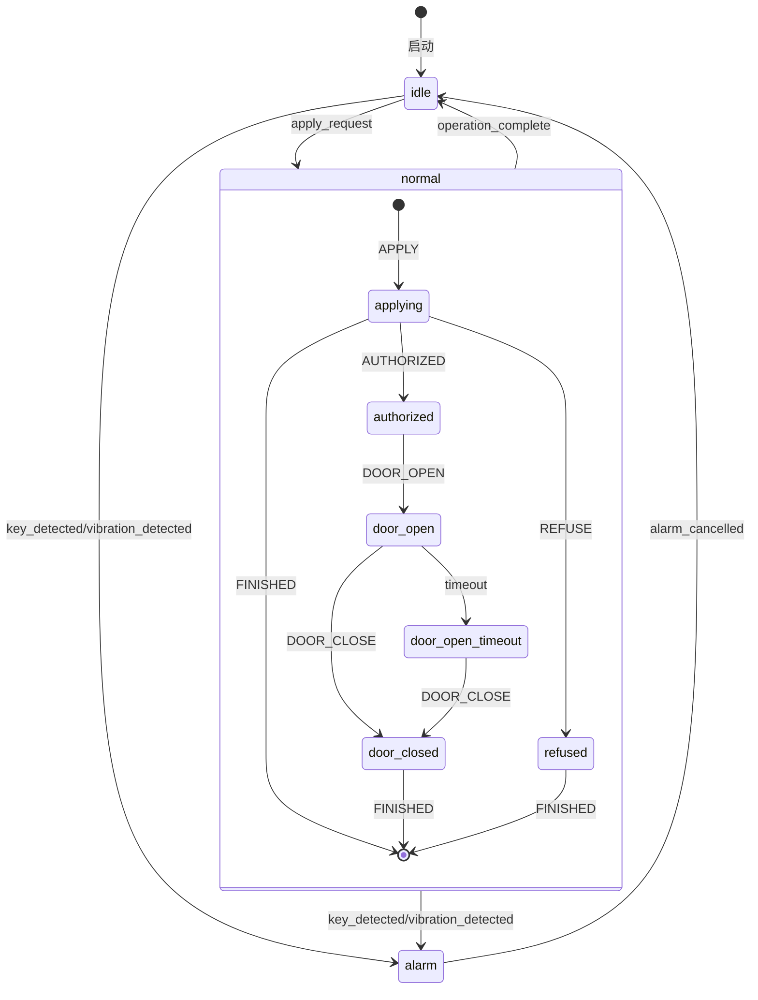
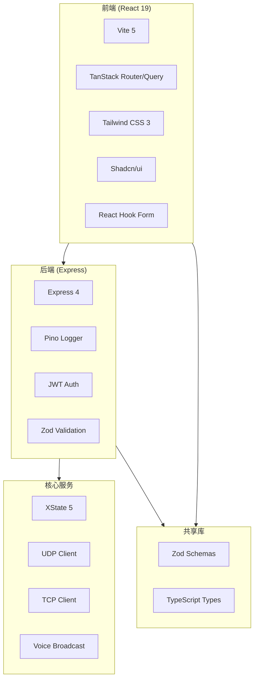

# Node Switch 项目架构文档

> **最后更新**: 2025-12-31
> **项目类型**: 硬件通信服务系统
> **架构演进**: Node.js → Go 重写中

---

## 执行摘要

Node Switch 正在进行重大架构升级：从 **Node.js + TypeScript** 重写为 **Go 语言**。此决策基于详细的技术研究，预期带来：
- **2.6x 性能提升**（CPU 密集型任务）
- **76% 内存减少**
- **10-100x 部署简化**（Docker 镜像从 50MB 降至 2-13MB）
- **单一二进制部署**（跨平台编译支持 ARM）

---

## 目录

- [第 1 部分：Go 重写架构（当前目标）](#第-1-部分go-重写架构当前目标)
- [第 2 部分：原 Node.js 架构（历史参考）](#第-2-部分原-nodejs-架构历史参考)
- [第 3 部分：技术对比研究](#第-3-部分技术对比研究)

---

# 第 1 部分：Go 重写架构（当前目标）

## 1.1 决策背景

### 决策驱动因素

| 因素 | Go | Node.js | 改进 |
|------|-----|---------|------|
| **CPU 性能** | 251ms | 654ms | **2.6x** |
| **HTTP 吞吐量** | 450万 RPS | 200万 RPS | **2.25x** |
| **内存使用** | 基准 | +76% | **-76%** |
| **Docker 镜像** | 2-13MB | 25-200MB | **10-100x** |
| **二进制部署** | 单文件 | 需运行时 | **更简单** |

### 痛点解决

**原 Node.js 架构问题：**
- IPC 进程通信复杂度高
- XState 状态机库庞大（无 Go 等效）
- 部署需要 Node.js 运行时
- Docker 镜像 ~50MB（优化后）
- 内存占用较高

---

## 1.2 目标架构（Go 版本）

### 整体架构图

```
┌─────────────────────────────────────────┐
│         node-switch-go                  │
│         (单一进程，goroutines)          │
│                                         │
│  ┌───────────────────────────────────┐  │
│  │     HTTP/WebSocket Server         │  │
│  │        (标准库 net/http)          │  │
│  └───────────────┬───────────────────┘  │
│                  │                       │
│  ┌───────────────┴───────────────────┐  │
│  │     状态管理器 (State Manager)     │  │
│  │    (替代 XState，使用 channel)    │  │
│  └───┬─────────┬─────────┬─────────┬──┘  │
│      │         │         │         │     │
│  ┌───▼───┐ ┌──▼───┐ ┌──▼───┐ ┌──▼───┐ │
│  │ UDP   │ │ TCP  │ │Serial│ │Voice │ │
│  │Client │ │Client│ │Client│ │Ctrl  │ │
│  └───────┘ └──────┘ └──────┘ └──────┘ │
│     (goroutines)                       │
└─────────────────────────────────────────┘
```

### 架构优势对比

| 方面 | Node.js 版本 | Go 版本 | 改进 |
|------|-------------|---------|------|
| **进程模型** | IPC 进程通信 | 单进程 + goroutines | 消除 IPC 复杂度 |
| **状态管理** | XState 库（庞大） | 原生 channel + 模式 | 代码量减少 ~70% |
| **部署** | 需要 Node.js + 依赖 | 单一二进制文件 | 部署简化 10x |
| **并发** | 事件循环（单线程） | Goroutines（多核） | 真正并行 |
| **内存** | ~100MB+ | ~25MB | 减少 76% |
| **启动时间** | ~2-3秒 | <100ms | 更快 |

---

## 1.3 核心技术决策

### 1.3.1 状态管理（替代 XState）

**Node.js 版本 (XState):**
```typescript
const mainMachine = createMachine({
  id: 'main',
  initial: 'idle',
  states: {
    idle: { on: { APPLY: 'applying' } },
    applying: {
      initial: 'authorized',
      states: {
        authorized: { on: { DOOR_OPEN: 'door_open' } },
        // ... 复杂嵌套状态
      }
    }
  }
});
```

**Go 版本 (原生 channel):**
```go
type State int
const (
    StateIdle State = iota
    StateApplying
    StateAlarm
)

type StateMachine struct {
    current State
    events  chan Event
}

func (sm *StateMachine) Run() {
    for {
        select {
        case event := <-sm.events:
            sm.transition(event)
        }
    }
}
```

**优势：**
- 无外部依赖
- 代码量减少 ~70%
- 性能更好
- 更易于调试

### 1.3.2 配置管理：JSON5

**决策：使用 JSON5 格式**
- 支持**注释**（配置说明）
- 支持**尾随逗号**（更易编辑）
- 完全兼容 JSON（向后兼容）

**Go 配置示例:**
```go
type Config struct {
    CabinetHost string `json5:"cabinetHost" validate:"required,ip"`
    CabinetPort int    `json5:"cabinetPort" validate:"required,min=1,max=65535"`

    // 柜体端配置
    Cabinet struct {
        TargetHost string `json5:"targetHost" validate:"required,ip"`
        TargetPort int    `json5:"targetPort" validate:"required,min=1,max=65535"`
    } `json5:"cabinet"`

    // 语音播报配置
    VoiceBroadcast struct {
        Host string `json5:"host" validate:"required,ip"`
        Port int    `json5:"port" validate:"required,min=1,max=65535"`
    } `json5:"voiceBroadcast"`
}
```

**JSON5 配置文件示例:**
```json5
{
  // 柜体端通信配置
  "cabinet": {
    "targetHost": "192.168.1.101",  // 柜体端 IP
    "targetPort": 8000,             // UDP 端口
  },

  // 语音播报模块配置
  "voiceBroadcast": {
    "host": "192.168.1.103",
    "port": 50000,
  },
}
```

### 1.3.3 日志方案：标准库 slog

**使用 Go 1.21+ 标准库 `log/slog`**

```go
type Logger struct {
    *slog.Logger
}

func New(level string) *Logger {
    handler := slog.NewJSONHandler(os.Stdout, &slog.HandlerOptions{
        Level: parseLevel(level),
    })
    return &Logger{slog.New(handler)}
}
```

**优势：**
- 零外部依赖
- 性能优秀
- 结构化日志
- 官方支持

### 1.3.4 部署方案

**Node.js 版本:**
```dockerfile
FROM node:20-alpine
WORKDIR /app
COPY package*.json ./
RUN npm ci --only=production
COPY dist ./dist
CMD ["node", "dist/index.js"]
# 结果：~25-50MB
```

**Go 版本:**
```dockerfile
FROM scratch
COPY node-switch-go /
CMD ["/node-switch-go"]
# 结果：~2-5MB
```

---

## 1.4 项目结构

### Go 项目布局

```
node-switch-go/
├── cmd/
│   └── node-switch/
│       └── main.go              # 入口点
├── internal/
│   ├── state/                    # 状态管理（替代 XState）
│   │   ├── machine.go           # 状态机核心
│   │   ├── events.go            # 事件定义
│   │   └── transitions.go       # 状态转换
│   ├── hardware/                 # 硬件通信层
│   │   ├── udp/                 # UDP 客户端
│   │   ├── tcp/                 # TCP 客户端
│   │   ├── serial/              # 串口客户端
│   │   └── manager.go           # 通信管理器
│   ├── relay/                    # 继电器控制
│   │   ├── controller.go        # 命令构建
│   │   └── validator.go         # 验证逻辑
│   ├── voice/                    # 语音播报
│   │   └── client.go            # CX-815E 控制
│   ├── config/                   # 配置管理
│   │   └── config.go            # 配置加载和验证
│   ├── api/                      # HTTP/WebSocket API
│   │   ├── handlers.go          # 请求处理
│   │   ├── middleware.go        # 认证中间件
│   │   └── websocket.go         # WebSocket 支持
│   └── logger/                   # 结构化日志
│       └── logger.go            # 日志封装
├── pkg/                          # 公共库
│   └── protocol/                 # 协议定义
│       └── types.go             # 共享类型
├── web/                          # 前端资源（保持不变）
│   └── dist/                    # React 构建产物
├── go.mod
├── go.sum
├── Dockerfile
└── Makefile
```

### 包组织原则

- `internal/`: 内部包，不可被外部导入（Go 编译器强制）
- `pkg/`: 公共库，可被外部项目使用
- `cmd/`: 入口点

---

## 1.5 实施计划

### 渐进式迁移策略

**阶段 1：核心硬件服务（2-3 周）**
- [ ] 状态机模块（替代 XState）
- [ ] UDP/TCP/Serial 通信模块
- [ ] 继电器控制模块
- [ ] 语音播报模块
- [ ] 单元测试覆盖

**阶段 2：HTTP/WebSocket API（1-2 周）**
- [ ] REST API 端点
- [ ] WebSocket 支持
- [ ] 认证中间件
- [ ] 配置管理 API

**阶段 3：前端集成（1 周）**
- [ ] 前端资源嵌入
- [ ] API 兼容性测试
- [ ] 端到端测试

**阶段 4：部署和优化（1 周）**
- [ ] Docker 镜像构建
- [ ] 交叉编译（ARM）
- [ ] 性能优化
- [ ] 生产环境测试

### 并行开发策略

**方案 A：全新开发（推荐）**
- 保留现有 Node.js 版本运行
- 新开 Go 版本分支开发
- 通过 A/B 测试验证功能
- 灰度切换

**迁移路径:**
```
┌─────────────────────────────────────────┐
│         当前生产环境                      │
│     (Node.js 版本继续运行)               │
└─────────────────────────────────────────┘
                 │
                 ▼
┌─────────────────────────────────────────┐
│      开发 Go 版本（新分支）               │
│  1. 项目骨架搭建                         │
│  2. 核心模块开发                         │
│  3. API 兼容性测试                       │
│  4. 性能基准测试                         │
└─────────────────────────────────────────┘
                 │
                 ▼
┌─────────────────────────────────────────┐
│      灰度发布（A/B 测试）                 │
│  1. 小流量验证                           │
│  2. 监控指标对比                         │
│  3. 功能等价验证                         │
└─────────────────────────────────────────┘
                 │
                 ▼
┌─────────────────────────────────────────┐
│      完全切换                            │
│  1. 全量切换到 Go 版本                   │
│  2. 下线 Node.js 版本                    │
│  3. 清理旧代码                           │
└─────────────────────────────────────────┘
```

---

## 1.6 成功指标

### 性能指标

| 指标 | 当前 (Node.js) | 目标 (Go) | 验证方法 |
|------|---------------|----------|----------|
| 内存占用 | ~100MB | <30MB | 监控工具 |
| 启动时间 | ~2-3s | <100ms | 计时 |
| HTTP 延迟 (p99) | ~50ms | <20ms | 压测 |
| 并发连接 | ~1k | >10k | 压测 |
| Docker 镜像 | ~50MB | <10MB | 镜像大小 |

### 开发效率

| 指标 | 目标 |
|------|------|
| 代码行数减少 | >30% |
| 构建时间 | <5s |
| 测试覆盖率 | >80% |
| 编译速度 | <10s |

---

# 第 2 部分：原 Node.js 架构（历史参考）

## 2.1 项目概述

**Node Switch** 是一个基于 Node.js + TypeScript 的硬件通信服务系统，用于继电器控制和语音播报。项目采用 monorepo 架构，包含 4 个主要部件。

### 核心功能

| 功能 | 描述 |
|------|------|
| **UDP 通信** | 与柜体端、控制端等设备通信 |
| **继电器控制** | 8路继电器开闭、延时控制、状态查询 |
| **语音播报** | CX-815E 语音模块集成，支持 TTS 播报 |
| **状态轮询** | 自动轮询设备状态并记录变化 |
| **配置管理** | Web UI 配置系统参数 |

---

## 2.2 项目结构

### 仓库结构

```
node-switch/                    # Monorepo 根目录
├── packages/
│   ├── frontend/               # React 前端应用
│   ├── backend/                # Express API 后端
│   └── shared/                 # 共享类型和验证
├── src/                        # 核心硬件控制服务
├── docs/                       # 项目文档
├── config/                     # 配置文件
├── test/                       # 测试文件
└── scripts/                    # 构建脚本
```

### 部件分类

| 部件 | 类型 | 路径 | 技术栈 | 描述 |
|------|------|------|--------|------|
| **Core** | Embedded | `src/` | XState + UDP/TCP | 硬件通信核心服务 |
| **Frontend** | Web | `packages/frontend/` | React 19 + Vite + TanStack | 配置管理前端 |
| **Backend** | Backend | `packages/backend/` | Express + JWT + Pino | REST API 服务 |
| **Shared** | Library | `packages/shared/` | TypeScript + Zod | 共享验证逻辑 |

---

## 2.3 核心硬件服务 (src/)

### 目录结构

```
src/
├── index.ts                    # 应用入口
├── business-logic/             # 业务逻辑
│   └── relay-status-aggregator.ts
├── config/                     # 配置管理 (Zod 校验)
├── hardware/                   # 硬件通信管理器
│   ├── manager.ts              # UDP/TCP 通信管理
│   └── initializer.ts          # 硬件初始化
├── state-machines/             # XState 状态机
│   ├── main-machine.ts         # 主状态机
│   ├── apply-ammo-machine.ts   # 供弹流程状态机
│   ├── monitor-machine.ts      # 监控状态机
│   └── alarm-machine.ts        # 报警状态机
├── relay/                      # 继电器控制
│   ├── controller.ts           # 命令构建器
│   ├── reset.ts                # 继电器重置
│   └── validation.ts           # 继电器验证
├── voice-broadcast/            # 语音播报
│   ├── index.ts                # 控制器
│   ├── initializer.ts          # 初始化
│   └── types.ts                # 类型定义
├── udp/                        # UDP 客户端
├── tcp/                        # TCP 客户端
├── logger/                     # Pino 日志封装
└── types/                      # 类型定义
```

### 状态机架构



### 硬件通信

**HardwareCommunicationManager** 提供统一的硬件通信接口：

- **UDP 客户端**: 与柜体端/控制端通信 (端口 8000)
- **TCP 客户端**: 与语音播报模块通信 (端口 50000)
- **支持多客户端**: 可同时管理多个 UDP/TCP 连接

---

## 2.4 前端应用 (packages/frontend/)

### 技术栈

| 技术 | 版本 | 用途 |
|------|------|------|
| React | 19.0.0 | UI 框架 |
| Vite | 5.2.0 | 构建工具 |
| TanStack Router | 1.31.15 | 路由管理 |
| TanStack Query | 5.28.9 | 数据获取 |
| Tailwind CSS | 3.4.17 | 样式 |
| Shadcn/ui | - | UI 组件库 |
| React Hook Form | 7.69.0 | 表单管理 |
| Zod | 4.2.1 | 表单验证 |

### 目录结构

```
packages/frontend/src/
├── main.tsx                    # 应用入口
├── routes/                     # TanStack Router 路由
│   ├── __root.tsx              # 根布局
│   ├── _auth.tsx               # 认证保护布局
│   ├── _auth.index.tsx         # 仪表盘首页
│   └── login.tsx               # 登录页
├── components/
│   ├── dashboard/              # 仪表盘组件
│   ├── layout/                 # 布局组件
│   ├── system/                 # 系统组件
│   └── ui/                     # Shadcn UI 组件
├── hooks/                      # 自定义 Hooks
├── contexts/                   # React Context
├── api/                        # API 客户端
└── lib/                        # 工具函数
```

---

## 2.5 后端 API (packages/backend/)

### 技术栈

| 技术 | 版本 | 用途 |
|------|------|------|
| Express | 4.21.2 | Web 框架 |
| Pino | 10.1.0 | 日志 |
| JWT | 9.0.3 | 认证 |
| Zod | 4.2.1 | 验证 |
| XState | 5.12.1 | 状态管理 |

### 目录结构

```
packages/backend/src/
├── index.ts                    # 应用入口
├── server.ts                   # Express 配置
├── routes/                     # API 路由
├── services/                   # 业务服务
├── middleware/                 # 中间件
└── utils/                      # 工具函数
```

### API 端点

| 方法 | 路径 | 认证 | 描述 |
|------|------|------|------|
| POST | `/api/auth/login` | 公开 | 用户登录 |
| GET | `/api/config` | 需认证 | 获取配置 |
| PUT | `/api/config` | 需认证 | 更新配置 |
| GET | `/api/config/export` | 需认证 | 导出配置 |
| POST | `/api/config/import` | 需认证 | 导入配置 |
| GET | `/api/status` | 需认证 | 系统状态 |
| POST | `/api/system/restart` | 需认证 | 重启系统 |
| GET | `/health` | 公开 | 健康检查 |

---

## 2.6 共享库 (packages/shared/)

### 导出内容

**Schemas (Zod 验证)**:
- `configSchema` - 配置验证
- `networkConfigSchema` - 网络配置验证
- `deviceStatusSchema` - 设备状态验证
- `apiResponseSchema` - API 响应验证
- `loginRequestSchema` - 登录请求验证

**Types**:
- `Config` - 配置类型
- `NetworkConfig` - 网络配置类型
- `DeviceStatus` - 设备状态类型
- `ApiResponse` - API 响应类型

---

## 2.7 部署

### Systemd 服务

```bash
# 构建并部署
pnpm build
sudo mkdir -p /opt/node-switch
sudo cp -r dist package.json pnpm-lock.yaml .env /opt/node-switch/
cd /opt/node-switch && sudo pnpm install --prod

# 安装服务
sudo cp config/node-switch.service /etc/systemd/system/
sudo systemctl daemon-reload
sudo systemctl enable --now node-switch
```

### 服务管理

```bash
sudo systemctl start node-switch    # 启动
sudo systemctl stop node-switch     # 停止
sudo systemctl restart node-switch  # 重启
sudo systemctl status node-switch   # 状态
journalctl -u node-switch -f        # 日志
```

---

# 第 3 部分：技术对比研究

## 3.1 Microsoft 的验证

Microsoft 正在用 Go 重写 TypeScript 编译器（Project Corsa），目标：
- **10x 性能提升**
- VS Code 加载时间减少 **8x**
- 内存使用减少 **40%**

这证明了 Go 在开发工具和系统服务场景下的巨大优势。

## 3.2 技术栈总览



---

## 附录：参考文档

| 文档 | 描述 |
|------|------|
| [ETH 设备通信协议说明V42.md](ETH%20设备通信协议说明V42.md) | 协议规范 |
| [CX-815E 网口语音播报模块集成指南 (V1.0).md](CX-815E%20网口语音播报模块集成指南%20(V1.0).md) | 硬件集成 |
| [状态机设计方案.md](状态机设计方案.md) | 状态机设计 |
| [状态机清单.md](状态机清单.md) | 状态机列表 |
| [业务流转状态.md](业务流转状态.md) | 业务流程 |
