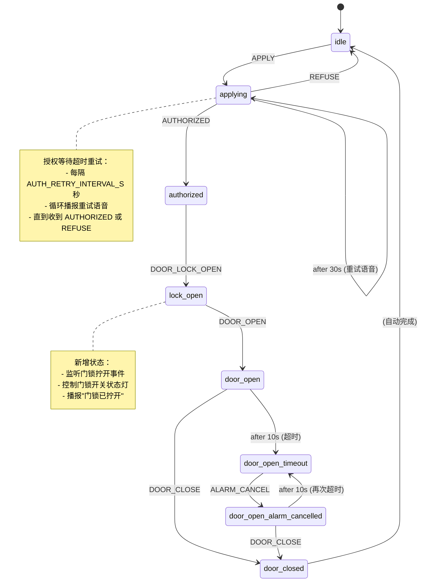

# Tech-Spec: 增强申请供弹流程

**Created:** 2025-12-31
**Status:** Ready for Development

## 概述

### 问题陈述

当前申请供弹流程存在以下缺陷：

1. **缺少授权等待超时提醒**：用户申请供弹后，如果控制端长时间未响应，柜体端没有重复播报提醒
2. **缺少门锁状态监听**：当前只监听了柜门状态（`cabinet_lock_changed`），没有监听门锁开关状态（`door_lock_switch`）
3. **流程不完整**：根据 `docs/状态机清单.md`，应该包含更多状态和事件，但当前实现缺少：
   - `authorized` → `lock_open` 的门锁拧开状态监听
   - 门锁开关状态灯的控制逻辑
   - 完整的语音播报流程
4. **申请流程中仍响应警报**：根据状态机清单，供弹流程中不应该响应振动和钥匙报警

### 解决方案

1. **实现授权等待超时重试机制**：在 `applying` 状态下，使用 XState 的 `after` 钩子实现循环超时重试，定期播报语音提醒
2. **添加配置项**：在 `config.json5` 中添加 `AUTH_RETRY_INTERVAL_S` 配置项，控制重试间隔
3. **添加门锁状态监听**：监听 CI2（门锁开关）状态变化，生成 `door_lock_switch_changed` 事件
4. **完善申请供弹流程**：根据状态机清单，添加 `lock_open` 状态和相关事件处理
5. **修改警报响应逻辑**：在 `normal` 状态下（申请供弹流程进行中），不响应钥匙和振动报警

### 范围（In/Out）

**包含：**
- 修改 `apply-ammo-machine.ts`，添加授权等待超时重试逻辑
- 在 `config.json5` 添加 `AUTH_RETRY_INTERVAL_S` 配置项
- 更新 Zod 配置验证 schema（`packages/shared/src/schemas/config.schema.ts`）
- 在 `packages/core/src/app.ts` 添加门锁开关状态监听
- 修改 `main-machine.ts`，添加门锁事件转发逻辑
- 修改 `main-machine.ts` 的 `normal` 状态，移除警报响应
- 更新前端配置界面，添加新的配置项（可选）
- 添加相关测试用例

**不包含：**
- 修改监控报警逻辑（`monitor-machine.ts` 保持不变）
- 修改警报状态机（`alarm-machine.ts` 保持不变）
- 硬件通信层修改（`HardwareCommunicationManager` 保持不变）

---

## 开发上下文

### 代码库模式

- **状态机框架**：使用 XState v5 进行状态管理
- **配置管理**：使用 `config.json5` + Zod schema 验证
- **事件命名**：使用 `snake_case` 格式（如 `apply_request`、`door_lock_switch_changed`）
- **日志模块**：使用 `createModuleLogger('ModuleName')`
- **导入风格**：使用 `.js` 扩展名
- **类型定义**：使用 XState 的 `types` 系统进行强类型检查

### 需要参考的文件

| 文件 | 说明 | 变更类型 |
|------|------|----------|
| `docs/状态机清单.md` | 业务逻辑参考文档 | 只读 |
| `packages/core/src/state-machines/apply-ammo-machine.ts` | 申请供弹状态机（需重构） | MODIFY |
| `packages/core/src/state-machines/main-machine.ts` | 主状态机（需修改） | MODIFY |
| `packages/core/src/app.ts` | 硬件事件监听（需添加） | MODIFY |
| `config.json5` | 配置文件（需添加配置项） | MODIFY |
| `packages/shared/src/schemas/config.schema.ts` | 配置验证 schema（需更新） | MODIFY |
| `packages/core/src/config/index.ts` | 配置导出（需更新） | MODIFY |
| `packages/core/src/types/state-machine.ts` | 状态机类型定义（参考） | READ |
| `packages/frontend/src/components/dashboard/ConfigForm.tsx` | 前端配置表单（可选更新） | OPTIONAL |

### 技术决策

1. **超时重试策略**：使用 XState 的 `after` 钩子自循环实现无限重试
   ```typescript
   applying: {
     after: {
       [config.AUTH_RETRY_INTERVAL_S * 1000]: {
         target: 'applying',
         actions: 'broadcastRetry'
       }
     }
   }
   ```

2. **新增状态**：添加 `lock_open` 状态，监听门锁拧开事件
   - `authorized` → `lock_open`：收到 `DOOR_LOCK_OPEN` 事件
   - `lock_open` → `door_open`：收到 `DOOR_OPEN` 事件

3. **门锁状态监听**：
   - 在 `app.ts` 中监听 CI2（`DOOR_LOCK_SWITCH_INDEX`）状态变化
   - 生成 `door_lock_switch_changed` 事件（包含 `isOpen` 属性）
   - 在 `main-machine.ts` 的 `normal` 状态中转发给 `applyAmmo` actor

4. **警报响应控制**：
   - 在 `main-machine.ts` 的 `normal` 状态中，移除 `key_detected` 和 `vibration_detected` 事件处理
   - 只在 `idle` 状态响应钥匙和振动报警

5. **配置默认值**：`AUTH_RETRY_INTERVAL_S` 默认为 30 秒

---

## 实现计划

### 任务列表

- [ ] **Task 1: 添加配置项和验证**
  - 在 `config.json5` 添加 `AUTH_RETRY_INTERVAL_S: 30`
  - 更新 `packages/shared/src/schemas/config.schema.ts`：
    - 添加 `AUTH_RETRY_INTERVAL_S` 字段验证
    - 类型：正整数，最小值 5 秒，最大值 300 秒（5 分钟）
    - 默认值：30 秒
  - 更新 `packages/core/src/config/index.ts`，导出新配置项

- [ ] **Task 2: 添加门锁状态监听**
  - 在 `packages/core/src/app.ts` 中添加 CI2（门锁开关）状态监听
  - 生成 `door_lock_switch_changed` 事件（格式：`{ type: 'door_lock_switch_changed', isOpen: boolean }`）
  - 参考 `cabinet_lock_changed` 事件的实现方式

- [ ] **Task 3: 更新主状态机事件转发**
  - 在 `packages/core/src/state-machines/main-machine.ts` 的 `normal` 状态中：
    - 添加 `door_lock_switch_changed` 事件监听
    - 转发为 `DOOR_LOCK_OPEN` / `DOOR_LOCK_CLOSE` 事件给 `applyAmmo` actor
  - 移除 `normal` 状态中的 `key_detected` 和 `vibration_detected` 事件处理

- [ ] **Task 4: 重构申请供弹状态机**
  - 修改 `packages/core/src/state-machines/apply-ammo-machine.ts`：
    - 添加 `DOOR_LOCK_OPEN` 和 `DOOR_LOCK_CLOSE` 事件类型
    - 添加 `lock_open` 状态
    - 在 `applying` 状态添加超时重试逻辑（`after` 钩子）
    - 添加 `broadcastRetry` action（播报重试语音）
    - 添加 `broadcastLockOpen` action（门锁拧开语音）
    - 修改状态流转：`authorized` → `lock_open` → `door_open`

- [ ] **Task 5: 更新前端配置界面（可选）**
  - 在 `packages/frontend/src/components/dashboard/ConfigForm.tsx` 添加新配置项
  - 添加表单字段：授权重试间隔（秒）
  - 添加验证规则和帮助文本

- [ ] **Task 6: 添加测试用例**
  - 添加配置验证测试：`packages/core/__tests__/auth-retry-interval-config.test.ts`
  - 添加状态机测试：`packages/core/__tests__/state-machines/apply-ammo-machine.enhanced.test.ts`
  - 测试超时重试逻辑
  - 测试门锁状态流转
  - 测试警报不响应逻辑

### 验收标准

- [ ] **AC 1**：配置项 `AUTH_RETRY_INTERVAL_S` 可通过配置文件设置，默认值为 30 秒
- [ ] **AC 2**：申请供弹后，每隔 `AUTH_RETRY_INTERVAL_S` 秒自动播报重试语音（柜体端："等待授权中"，控制端："申请供弹等待中，请授权"）
- [ ] **AC 3**：授权通过后，门锁拧开时触发门锁开关状态灯（CO3），并播报相应语音
- [ ] **AC 4**：在 `normal` 状态（申请供弹流程中）不响应钥匙和振动报警
- [ ] **AC 5**：所有测试通过（`pnpm test`）
- [ ] **AC 6**：TypeScript 编译无错误（`pnpm build`）

---

## 附加上下文

### 依赖关系

- **XState v5**：状态机框架（使用 `after` 钩子实现超时）
- **配置系统**：依赖 `config.json5` 和 Zod 验证
- **语音播报模块**：使用 `VoiceBroadcast.getInstance().cabinet/control.broadcast()`

### 测试策略

1. **单元测试**：
   - 配置验证测试（Zod schema）
   - 状态机流转测试（使用 XState 的 `createActor` 测试）

2. **集成测试**：
   - 测试超时重试逻辑（使用 fake timer）
   - 测试门锁状态监听和事件转发
   - 测试警报不响应逻辑

3. **Mock 策略**：
   - Mock `VoiceBroadcast.getInstance()` 的播报方法
   - Mock `HardwareCommunicationManager` 的硬件命令

### 状态机流转图（更新后）



### 文件变更概览

```diff
config.json5                                 [MODIFY] 添加 AUTH_RETRY_INTERVAL_S
packages/shared/src/schemas/
└── config.schema.ts                         [MODIFY] 添加配置验证
packages/core/src/
├── config/
│   └── index.ts                             [MODIFY] 导出新配置项
├── app.ts                                   [MODIFY] 添加门锁状态监听
└── state-machines/
    ├── main-machine.ts                      [MODIFY] 事件转发 + 移除警报响应
    └── apply-ammo-machine.ts                [MODIFY] 添加超时重试 + lock_open 状态
packages/core/__tests__/
├── auth-retry-interval-config.test.ts       [NEW]    配置验证测试
└── state-machines/
    └── apply-ammo-machine.enhanced.test.ts  [NEW]    状态机增强测试
packages/frontend/src/components/dashboard/
└── ConfigForm.tsx                           [OPTIONAL] 添加新配置项界面
```

### 状态机事件映射表

| 事件名称 | 触发条件 | 目标状态 | Action |
|---------|---------|---------|--------|
| `APPLY` | 用户按下申请按钮（CI0） | `idle → applying` | 开启申请灯 + 播报申请语音 |
| `AUTHORIZED` | 控制端授权通过（CTI10） | `applying → authorized` | 开锁 + 播报授权通过语音 |
| **（新）** `DOOR_LOCK_OPEN` | 门锁拧开（CI2=open） | `authorized → lock_open` | 门锁开关状态灯亮 + 播报语音 |
| `DOOR_OPEN` | 柜门打开（CI1=open） | `lock_open → door_open` | 播报开门语音 |
| `DOOR_CLOSE` | 柜门关闭（CI1=close） | `door_open → door_closed` | 播报关门语音 |
| **（新）** `after 30s` | 授权等待超时 | `applying → applying`（自循环） | 播报重试语音 |
| `REFUSE` | 控制端授权拒绝（CTI9） | `applying → idle` | 熄灯 + 播报拒绝语音 |

### 语音播报内容

| 场景 | 柜体端 | 控制端 |
|-----|-------|-------|
| 申请供弹 | "已申请，请等待授权" | "申请供弹请授权" |
| **（新增）** 超时重试 | "等待授权中" | "申请供弹等待中，请授权" |
| 授权通过 | "授权通过，已开锁请打开柜门" | "授权通过，已开锁" |
| **（新增）** 门锁拧开 | "门锁已拧开，请打开柜门" | "门锁已拧开" |
| 柜门打开 | "已开门，请取弹，取弹后请关闭柜门" | "柜门已打开" |
| 柜门关闭 | "柜门已关闭，请拧回门锁开关" | "柜门已关闭" |
| 供弹完毕 | "供弹完毕" | "供弹完毕" |
| 授权拒绝 | "授权未通过，供弹结束" | "授权未通过，供弹结束" |

### 备注

1. **超时重试的循环机制**：
   - 使用 XState 的 `after` 钩子自循环实现
   - 一旦收到 `AUTHORIZED` 或 `REFUSE` 事件，立即退出 `applying` 状态，清除计时器
   - 授权通过/取消操作优先于超时事件

2. **门锁状态监听的实现细节**：
   - 参考 `cabinet_lock_changed` 事件的实现
   - 在 `app.ts` 的 `handleInputChange` 函数中添加 CI2 的处理
   - 注意 `INVERT_SENSOR_STATE` 配置的影响

3. **警报响应的变更**：
   - 只在 `idle` 状态响应钥匙和振动报警
   - `normal` 状态不响应这些报警，确保申请供弹流程不被打断
   - `alarm` 状态保持不变，继续处理监控异常

4. **测试注意事项**：
   - 使用 fake timer 测试超时逻辑（`jest.useFakeTimers()`）
   - 测试重试语音是否按预期间隔播报
   - 测试门锁状态转换的正确性
   - 测试警报在 `normal` 状态下不响应

5. **向后兼容性**：
   - `AUTH_RETRY_INTERVAL_S` 配置项有默认值，现有配置文件无需修改即可运行
   - 新增的事件不影响现有流程（如果未实现门锁监听，状态机会保持在 `authorized` 状态）
