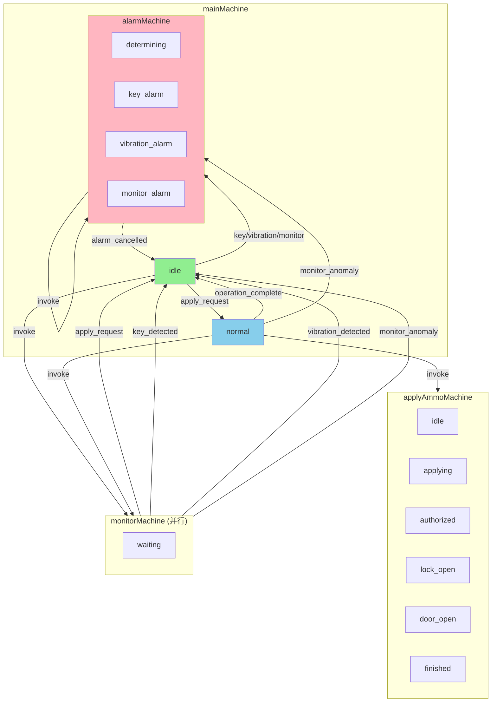

# Web 界面配置工具 PRD

## 产品概述

**文档版本：** 3.0
**产品：** Node-switch 项目的 Web 界面配置工具（Go 版本）
**更新日期：** 2025-12-31

本文档概述了 node-switch 项目 Web 界面配置工具的要求。该界面将提供一种用户友好的方式来修改项目配置和硬件系统设置，包括 IP 地址等网络配置。该界面将取代直接文件编辑的需要，并通过基于浏览器的仪表板提供集中、易访问的系统级和应用程序级设置管理。

**本版本重大变更：从 Node.js/TypeScript 重写为 Go 语言**

本版本将整个系统从 Node.js/TypeScript 技术栈重写为 Go 语言，带来以下关键改进：
- **单一进程架构**：使用 goroutines 替代 IPC 进程通信，架构更简洁
- **性能提升**：Go 在 CPU 密集型任务中比 Node.js 快 2.6x
- **部署简化**：单一静态二进制文件，Docker 镜像从 50MB 降至 2-13MB
- **内存效率**：内存使用减少 76%
- **跨平台编译**：支持轻松交叉编译到 ARM 平台（嵌入式设备）
- **状态机框架**：使用 `github.com/looplab/fsm` 成熟 FSM 框架替代 XState

---

## 目标

### 业务目标
- 减少手动配置更改所花费的时间
- 为非技术用户提供配置管理的易访问性
- 集中配置管理以减少错误和不一致
- 为未来功能扩展提供基础
- 实现远程配置管理能力
- **提高系统可靠性**：Go 版本使用单一进程 + goroutines，消除了 IPC 复杂度
- **简化部署**：单一静态二进制文件，无需 Node.js 运行时
- **增强性能**：内存使用减少 76%，CPU 性能提升 2.6x
- **增强可维护性**：统一语言技术栈，降低维护成本

### 用户目标
- 无需直接文件访问即可轻松修改应用程序设置
- 通过直观界面配置硬件系统参数
- 可视化监控当前配置状态
- 在应用前验证配置更改
- 从任何具有浏览器的设备访问配置管理
- 通过 Web 界面 **监控系统服务状态**（运行中/已停止/错误）
- 通过 Web 界面 **重启系统服务**（手动或自动）
- 配置修改后 **需手动触发重启** 以应用更改
- 获得系统运行状态的 **实时反馈**

### 非目标
- 替换现有硬件控制功能
- 实现超出配置的复杂硬件诊断
- 提供实时硬件监控（超出配置状态）
- 替换高级用户的命令行工具
- 包括硬件固件更新功能
- 不改变 Core 的业务逻辑和硬件控制功能
- 不实现分布式部署（仍为单机部署）
- 不更改 Frontend 与 Backend 的通信方式（HTTP/WebSocket）

---

## 系统架构

### Go 单一进程架构

#### 背景

原 Node.js 版本使用 Backend 和 Core 两进程分离架构，通过 IPC 通信。这种设计存在以下问题：

1. **IPC 复杂度高**：进程间通信需要复杂的消息序列化和错误处理
2. **状态同步困难**：两进程状态需要保持一致，增加维护成本
3. **部署复杂**：需要管理多个进程的启动顺序和生命周期
4. **资源占用高**：Node.js 运行时内存占用较大

#### 目标架构（Go 版本）

```
┌─────────────────────────────────────────────────────────┐
│              node-switch-go (单一进程)                    │
│                                                          │
│  ┌─────────────────────────────────────────────────┐    │
│  │     HTTP/WebSocket Server (标准库 net/http)     │    │
│  │        + 嵌入式 React 前端资源                    │    │
│  └──────────────────┬──────────────────────────────┘    │
│                     │                                   │
│  ┌──────────────────┴──────────────────────────────┐    │
│  │       状态管理器 (looplab/fsm)                   │    │
│  │    主状态机 + 申请供弹状态机 + 报警状态机         │    │
│  └───┬────────┬────────┬────────┬────────────┬────┘    │
│      │        │        │        │            │          │
│  ┌───▼───┐ ┌──▼───┐ ┌──▼───┐ ┌──▼───┐    ┌──▼───┐    │
│  │ UDP   │ │ TCP  │ │Serial│ │Voice │    │ HTTP │    │
│  │Client │ │Client│ │Client│ │Ctrl  │    │ API  │    │
│  └───────┘ └──────┘ └──────┘ └──────┘    └──────┘    │
│     (goroutines)         (goroutines)                 │
└─────────────────────────────────────────────────────────┘
```

#### 架构优势

| 方面 | Node.js 版本 | Go 版本 | 改进 |
|------|-------------|---------|------|
| **进程模型** | IPC 进程通信 | 单一进程 + goroutines | 消除 IPC 复杂度 |
| **状态管理** | XState 库（~500KB） | looplab/fsm + channels | 代码量减少 |
| **部署** | 需要 Node.js + 依赖 | 单一二进制文件 | 部署简化 10x |
| **并发** | 事件循环（单线程） | Goroutines（多核） | 真正并行 |
| **内存** | ~100MB+ | ~25MB | 减少 76% |
| **启动时间** | ~2-3秒 | <100ms | 更快 |
| **Docker 镜像** | ~50MB | ~2-13MB | 减少 10-100x |

---

## 用户画像

### 主要用户类型
- **系统管理员：** 负责部署和维护的技术用户
- **运营经理：** 需要偶尔配置访问的业务用户
- **技术支持：** 需要配置访问的客户服务人员
- **开发人员：** 需要测试配置更改的团队成员

### 基本用户画像详情
- **技术水平：** 技术和非技术用户的混合
- **设备使用：** 各种设备，包括台式机、笔记本电脑和平板电脑
- **频率：** 根据角色而定的偶尔到每日使用
- **目标：** 快速、可靠的配置更改，学习曲线最小


---

## 功能需求

### 配置管理功能

#### 高优先级
| ID | 需求 | 描述 |
|----|------|------|
| FR-001 | 显示配置 | 以可读格式显示当前系统和应用程序配置 |
| FR-002 | 修改应用设置 | 通过 Web 界面允许修改应用程序级设置 |
| FR-003 | 修改网络设置 | 通过 Web 界面允许修改系统级网络设置（IP 地址、网络参数） |
| FR-004 | 验证配置 | 保存前验证配置更改 |
| FR-005 | 保存配置 | 将配置更改保存到 config.json5 文件 |
| FR-006 | 安全认证 | 实现配置访问的安全身份验证 |
| FR-007 | 视觉反馈 | 在保存操作期间提供视觉反馈 |

#### 中优先级
| ID | 需求 | 描述 |
|----|------|------|
| FR-008 | 导入导出 | 允许配置文件的导入/导出 |
| FR-011 | 错误显示 | 明确显示配置验证错误 |
| FR-012 | 测试网络 | 允许在应用前测试网络配置 |

### 进程管理功能

#### 高优先级
| ID | 需求 | 描述 |
|----|------|------|
| FR-101 | 进程分离 | Backend 使用 `child_process` API 启动 Core 作为独立子进程 |
| FR-102 | 状态监控 | Backend 监控 Core 进程状态（启动、运行、停止、崩溃） |
| FR-103 | 进程重启 | Backend 能够优雅地停止并重启 Core 进程 |
| FR-104 | 进程通信 | 建立 Backend 与 Core 之间的 IPC 通信通道 |
| FR-105 | 状态 API | 提供 REST API 供 Frontend 查询 Core 状态 |
| FR-106 | 重启 API | 提供 REST API 供 Frontend 触发 Core 重启 |

#### 中优先级
| ID | 需求 | 描述 |
|----|------|------|
| FR-107 | 自动恢复 | Core 崩溃后自动重启（可配置重试次数） |
| FR-108 | 手动重启应用配置 | 配置修改后，用户需通过界面手动触发 Core 重启以应用更改 |
| FR-109 | 日志转发 | Core 日志通过 IPC 转发到 Backend 统一管理 |
| FR-110 | 状态推送 | 通过 WebSocket 实时推送 Core 状态变化到 Frontend |

#### 低优先级
| ID | 需求 | 描述 |
|----|------|------|
| FR-111 | 启动超时 | 配置 Core 启动超时时间，超时视为启动失败 |
| FR-112 | 健康检查 | 定期心跳检测 Core 运行状况 |

---

## 技术设计

### 状态机模块（使用 looplab/fsm）

**位置：** `internal/state/machines/`

**核心依赖：** `github.com/looplab/fsm`

```go
// machines/main_machine.go
package machines

import (
    "context"
    "github.com/looplab/fsm"
)

// MainMachine 主状态机
// 状态：idle -> normal -> alarm
type MainMachine struct {
    FSM *fsm.FSM
}

// NewMainMachine 创建主状态机
func NewMainMachine() *MainMachine {
    m := &MainMachine{}

    m.FSM = fsm.NewFSM(
        "idle", // 初始状态
        fsm.Events{
            // 正常业务流程
            {Name: "apply_request", Src: []string{"idle"}, Dst: "normal"},
            {Name: "operation_complete", Src: []string{"normal"}, Dst: "idle"},

            // 报警流程
            {Name: "key_detected", Src: []string{"idle", "normal"}, Dst: "alarm"},
            {Name: "vibration_detected", Src: []string{"idle", "normal"}, Dst: "alarm"},
            {Name: "monitor_anomaly", Src: []string{"idle", "normal"}, Dst: "alarm"},
            {Name: "alarm_cancelled", Src: []string{"alarm"}, Dst: "idle"},
        },
        fsm.Callbacks{
            "enter_idle": func(_ context.Context, e *fsm.Event) {
                m.onEnterIdle(e)
            },
            "enter_normal": func(_ context.Context, e *fsm.Event) {
                m.onEnterNormal(e)
            },
            "enter_alarm": func(_ context.Context, e *fsm.Event) {
                m.onEnterAlarm(e)
            },
        },
    )

    return m
}

func (m *MainMachine) onEnterIdle(e *fsm.Event) {
    // 进入待机状态，启动监控
}

func (m *MainMachine) onEnterNormal(e *fsm.Event) {
    // 进入正常业务流程，启动申请供弹状态机
}

func (m *MainMachine) onEnterAlarm(e *fsm.Event) {
    // 进入报警状态，启动报警状态机
}
```

### 硬件通信模块

**位置：** `internal/hardware/`

每个硬件客户端在独立的 goroutine 中运行：

```go
// manager.go
package hardware

import (
    "context"
    "golang.org/x/sync/errgroup"
)

type Manager struct {
    udpClient    *udp.Client
    tcpClient    *tcp.Client
    serialClient *serial.Client
    voiceClient  *voice.Client
}

func (m *Manager) Start(ctx context.Context) error {
    g, ctx := errgroup.WithContext(ctx)

    // 每个 goroutine 独立运行一个硬件客户端
    g.Go(func() error {
        return m.udpClient.Run(ctx)
    })

    g.Go(func() error {
        return m.tcpClient.Run(ctx)
    })

    g.Go(func() error {
        return m.serialClient.Run(ctx)
    })

    g.Go(func() error {
        return m.voiceClient.Run(ctx)
    })

    return g.Wait()
}
```

### API 端点设计

| 方法 | 端点 | 描述 |
|------|------|------|
| GET | `/api/status` | 获取系统状态 |
| GET | `/api/config` | 获取配置 |
| POST | `/api/config` | 更新配置 |
| POST | `/api/system/restart` | 重启系统服务 |
| GET | `/api/system/health` | 健康检查 |
| WS | `/ws` | WebSocket 实时状态推送 |

### 配置管理

**格式：** JSON5（支持注释和尾随逗号）

**位置：** `config.json5`

```json5
{
  // 应用配置
  "app": {
    "name": "node-switch-go",
    "env": "production",
    "logLevel": "info",
  },

  // HTTP 服务配置
  "http": {
    "port": 3000,
    "host": "0.0.0.0",
  },

  // 柜体端通信配置
  "cabinet": {
    "targetHost": "192.168.1.101",
    "targetPort": 8000,
    "timeout": 5000,
  },

  // 语音播报模块配置
  "voiceBroadcast": {
    "host": "192.168.1.103",
    "port": 50000,
  },

  // 继电器配置
  "relay": {
    "count": 8,
    "defaultState": "closed",
  },
}
```

---

## 用户体验

### 入口点
- 显示当前配置摘要的主仪表板
- 导航到不同配置部分的菜单
- 频繁修改设置的快速访问面板

### 核心体验
- 用于配置修改的直观表单界面
- 用户输入值时的实时验证
- 已保存/未保存状态的清晰视觉指示

### 高级功能
- 配置导入/导出功能
- 系统级网络配置工具

### UI/UX 亮点
- 专注于配置任务的简洁、最小界面
- 清晰的错误消息和验证反馈
- 保存操作期间的进度指示器
- 相关配置选项的直观分组
- 与现有项目美学一致的样式

---

## 叙述

作为系统管理员，我希望通过 Web 界面轻松配置和管理我的 node-switch 应用程序，以便我可以在不需要直接文件访问的情况下修改设置。当我访问配置界面时，我应该看到一个干净的仪表板，逻辑地显示我的当前设置。我应该能够通过直观的表单修改应用程序参数，如超时、网络配置和硬件特定设置。在保存之前，系统应该验证我的更改并提醒我任何潜在问题。保存后，我应该收到确认信息，表明更改已成功应用，并且系统将在重新启动时或适当时立即使用新配置。

此外，我可以在 Web 界面上实时监控 Core 进程的运行状态。如果 Core 崩溃，Web 界面仍然可用，我可以查看崩溃信息并触发重启。配置更改保存后，系统会询问我是否立即重启 Core 以应用新配置，整个过程无需中断 Web 服务。

---

## 成功指标

### 用户中心指标
| 指标 | 目标 |
|------|------|
| 配置更改完成率 | >95% |
| 完成常见配置任务的时间 | <5 分钟 |
| 配置更改错误率 | <2% |

### 业务指标
| 指标 | 目标 |
|------|------|
| 配置更改部署的加快 | 加快 50% |
| 配置相关任务耗时的减少 | 减少 40% |

### 技术指标
| 指标 | 目标 |
|------|------|
| 界面加载时间 | <3 秒 |
| 配置验证准确性 | 100% |
| 配置更改期间的系统可用性 | 99.9% |

### 进程管理指标
| 指标 | 目标 |
|------|------|
| Core 崩溃后 Web 可用性 | 100%（Web 服务不受影响） |
| 自动恢复成功率 | ≥95% |
| 重启响应时间 | <5 秒 |

---

## 技术考虑

### 集成点
- 与现有 config.json5 存储系统的集成
- Go 1.21+ 标准库
- `github.com/looplab/fsm` 状态机框架
- `github.com/titanous/json5` 配置解析
- `log/slog` 结构化日志（Go 1.21+）
- 用于硬件交互的 UDP/TCP 通信协议（保持兼容）
- 嵌入式 React 前端资源

### 数据存储/隐私
- 配置数据以 config.json5 格式安全存储（支持注释）
- 适当的访问控制以防止未经授权的配置更改

### 可扩展性/性能
- 支持多用户同时配置访问
- 配置更改的有效验证
- 配置操作期间对系统性能的最小影响
- 配置数据检索的缓存机制
- 配置表单的优化渲染

### 代码影响分析

**Go 重写策略：全新开发**

由于语言和技术栈的根本性差异，采用全面重写而非逐步迁移的方式：

**保留部分：**
- 前端 React 代码（~2000 行）无需修改
- HTTP API 接口保持兼容
- WebSocket 协议保持兼容
- 硬件通信协议保持不变

**新增 Go 模块：**

1. `cmd/node-switch/main.go`
   - 入口点，初始化所有模块

2. `internal/state/machines/`
   - `main_machine.go` - 主状态机
   - `apply_ammo_machine.go` - 申请供弹状态机
   - `alarm_machine.go` - 报警状态机
   - `monitor_machine.go` - 监控状态机

3. `internal/hardware/`
   - `udp/client.go` - UDP 客户端
   - `tcp/client.go` - TCP 客户端
   - `serial/client.go` - 串口客户端
   - `voice/client.go` - 语音控制客户端
   - `manager.go` - 通信管理器

4. `internal/api/`
   - `server.go` - HTTP/WebSocket 服务器
   - `handlers.go` - 请求处理
   - `middleware.go` - 认证中间件

5. `internal/config/`
   - `config.go` - 配置加载和验证（JSON5）

6. `internal/logger/`
   - `logger.go` - 结构化日志（使用标准库 slog）

7. `web/dist/`
   - 嵌入式 React 前端资源

### 潜在挑战

| 挑战 | 解决方案 |
|------|----------|
| 状态机逻辑复杂 | 使用成熟框架 looplab/fsm，参考 XState 设计 |
| 硬件通信兼容性 | 保持协议不变，单元测试覆盖 |
| 团队学习曲线 | 提前培训，代码审查 |
| 部署风险 | 并行运行，灰度切换 |
| 配置验证 | 使用 Go 结构体标签和验证库 |
| 错误处理 | Go 习惯的 error 处理模式 |
| 日志统一 | 使用标准库 slog，结构化输出 |
| 性能调优 | pprof 工具分析，goroutine 泄漏检测 |

---

## 里程碑和排序

### 项目估算
- **总持续时间：** 8-10 周（Go 重写比原计划更快）
- **开发小时数：** 320-400 小时

### 团队规模
- 1-2 名 Go 后端开发人员
- 1 名前端开发人员（保持 React）
- 1 名 QA 工程师
- Go 语言技术顾问（兼职）

### 建议阶段

#### 第 1 阶段：Go 项目基础和状态机（1-2 周）
- [ ] 创建 Go 项目骨架
- [ ] 使用 looplab/fsm 实现主状态机
- [ ] 实现申请供弹状态机
- [ ] 实现报警状态机
- [ ] 实现监控状态机
- [ ] 编写状态机单元测试

#### 第 2 阶段：硬件通信模块（1-2 周）
- [ ] 实现 UDP 客户端
- [ ] 实现 TCP 客户端
- [ ] 实现串口客户端
- [ ] 实现语音控制客户端
- [ ] 实现通信管理器（errgroup 协调）
- [ ] 硬件通信集成测试

#### 第 3 阶段：HTTP/WebSocket API（1-2 周）
- [ ] 实现 HTTP 服务器
- [ ] 实现 REST API 端点
- [ ] 实现 WebSocket 实时推送
- [ ] 实现认证中间件
- [ ] 实现配置管理 API
- [ ] API 兼容性测试

#### 第 4 阶段：配置和日志（1 周）
- [ ] 实现 JSON5 配置加载
- [ ] 实现配置验证
- [ ] 集成标准库 slog 日志
- [ ] 实现日志级别控制

#### 第 5 阶段：前端集成（1 周）
- [ ] 嵌入 React 前端资源
- [ ] 实现 SPA 路由支持
- [ ] API 兼容性验证
- [ ] 端到端测试

#### 第 6 阶段：部署和优化（1-2 周）
- [ ] Docker 镜像构建（scratch 基础镜像）
- [ ] 交叉编译（ARM/x64）
- [ ] 性能基准测试
- [ ] 内存和 CPU 优化
- [ ] 生产环境部署测试

#### 第 7 阶段：测试和文档（1 周）
- [ ] 全面功能测试
- [ ] 性能压力测试
- [ ] 编写部署文档
- [ ] 编写 API 文档

---

## 用户故事

### 配置管理用户故事

#### US-001：查看当前配置
**标题：** 系统管理员查看当前配置
**描述：** 作为系统管理员，我希望以可读格式查看当前系统和应用程序配置，以便在进行更改前了解当前状态。
**验收标准：**
- 配置以有组织、可读的格式显示
- 系统级和应用程序级设置都可见
- 配置值有明确标记
- 界面在 3 秒内加载
- 响应式设计适用于不同屏幕尺寸

#### US-002：修改应用程序设置
**标题：** 用户修改应用程序级设置
**描述：** 作为系统管理员，我希望通过 Web 界面修改应用程序级设置，以便我可以调整参数而无需直接编辑文件。
**验收标准：**
- 所有应用程序设置都提供表单字段
- 可以更改设置值
- 提供实时输入验证
- 表单字段与 config.json 中定义的数据类型匹配
- 提供取消选项以放弃更改

#### US-003：修改网络设置
**标题：** 用户修改系统级网络设置
**描述：** 作为系统管理员，我希望修改 IP 地址等系统级网络设置，以便我可以通过 Web 界面配置网络参数。
**验收标准：**
- 提供网络配置字段（IP、子网、网关、DNS）
- 提供 IP 地址格式验证
- 保存前验证网络设置
- 对潜在破坏性更改显示警告
- 变更可以立即应用或在重启时应用

#### US-004：验证配置更改
**标题：** 系统在保存前验证配置
**描述：** 作为系统管理员，我希望在保存前验证配置更改，以便我可以避免可能破坏系统的无效配置。
**验收标准：**
- 在修改设置时进行实时验证
- 为无效值显示清晰的错误消息
- 验证规则与 Zod 架构定义匹配
- 验证配置依赖关系
- 无效配置无法保存

#### US-005：保存配置更改
**标题：** 用户将配置更改保存到文件
**描述：** 作为系统管理员，我希望将配置更改保存到 config.json 文件，以便系统使用新设置。
**验收标准：**
- 配置更改保存到 config.json 文件
- 保存后显示成功确认
- 系统可以在保存后重新加载新配置
- 保存期间维护文件权限
- 保持配置文件完整性

#### US-006：安全身份验证
**标题：** 用户在访问配置界面前进行身份验证
**描述：** 作为系统管理员，我希望在访问配置界面前进行身份验证，以便未授权用户无法修改系统设置。
**验收标准：**
- 访问配置前需要身份验证
- 执行强密码要求
- 会话超时防止未授权访问
- 记录登录尝试以供安全监控
- 禁用身份验证绕过机制

#### US-007：保存期间的视觉反馈
**标题：** 系统在保存操作期间提供反馈
**描述：** 作为系统管理员，我希望在保存操作期间获得视觉反馈，以便我知道系统正在处理我的更改。
**验收标准：**
- 保存操作期间显示进度指示器
- 保存完成后显示成功确认
- 保存失败时显示错误消息
- 保存操作期间禁用保存按钮
- 明确传达操作状态

#### US-008：导入配置文件
**标题：** 用户从文件导入配置
**描述：** 作为系统管理员，我希望从文件导入配置，以便我可以应用以前导出或准备的配置。
**验收标准：**
- 配置导入提供文件上传界面
- 应用前验证导入的配置
- 验证文件格式兼容性
- 应用前显示导入设置的预览
- 完成前可以取消导入操作

#### US-009：导出配置文件
**标题：** 用户将当前配置导出到文件
**描述：** 作为系统管理员，我希望将当前配置导出到文件，以便我可以备份设置或将它们应用到其他系统。
**验收标准：**
- 提供当前配置的导出功能
- 按正确格式生成配置文件
- 导出文件包含所有当前设置
- 导出文件可用于在其他系统上导入
- 导出操作成功完成


#### US-012：显示配置错误
**标题：** 系统显示配置验证错误
**描述：** 作为系统管理员，我希望配置验证错误清晰显示，以便我可以了解并修复配置更改中的问题。
**验收标准：**
- 验证错误显示在相关字段附近
- 错误消息具体且可操作
- 错误高亮视觉上明显
- 错误持续存在直到解决
- 可以同时显示多个错误


#### US-016：批量配置更改
**标题：** 用户执行批量配置更改
**描述：** 作为系统管理员，我希望通过 CSV 导入执行批量配置更改，以便我可以高效地一次更新多个设置。
**验收标准：**
- 提供批量更改的 CSV 导入界面
- 处理前验证 CSV 格式
- 应用前显示批量更改的预览
- 应用前可以取消批量更改
- 导入过程优雅处理错误


#### US-018：实时配置验证
**标题：** 系统提供实时配置验证
**描述：** 作为系统管理员，我希望在输入时进行实时配置验证，以便我可以立即看到我的配置更改是否有效。
**验收标准：**
- 在输入值时进行验证
- 立即指示有效/无效状态
- 验证反馈不会干扰但可见
- 实时验证不影响性能
- 验证规则与服务器端验证一致


---

### 进程管理用户故事

#### US-101：查看 Core 进程状态
**标题：** 用户查看 Core 运行状态
**描述：** 作为系统管理员，我希望在 Web 界面上查看 Core 进程的运行状态，以便了解硬件控制系统是否正常工作。
**验收标准：**
- 显示 Core 当前状态（运行中/已停止/启动中/错误）
- 显示 Core 启动时间和运行时长
- 状态变化时自动更新（无需手动刷新）
- 错误状态时显示错误信息

#### US-102：手动重启 Core
**标题：** 用户手动重启 Core 进程
**描述：** 作为系统管理员，我希望能够通过 Web 界面手动重启 Core 进程，以便在需要时应用配置更改或恢复系统。
**验收标准：**
- 提供"重启"按钮
- 重启前显示确认对话框
- 重启过程中显示进度状态
- 重启完成后显示成功/失败提示
- 需要身份验证才能执行重启操作

#### US-103：配置更改后提示用户重启
**标题：** 配置保存后提示用户重启 Core
**描述：** 作为系统管理员，我希望保存配置后系统提示我重启 Core 进程，以便新配置立即生效。
**验收标准：**
- 保存配置后提示"是否立即重启 Core 应用配置"
- 用户确认后自动执行重启
- 重启过程中显示状态

#### US-104：Core 崩溃自动恢复
**标题：** Core 崩溃后自动重启
**描述：** 作为系统管理员，我希望 Core 进程崩溃后系统能够自动重启，以减少人工干预。
**验收标准：**
- Core 异常退出后自动尝试重启
- 可配置最大重试次数（默认 3 次）
- 连续失败后停止重试并发送告警
- 记录崩溃和重启日志
- Web 界面显示崩溃历史

---

### 警报系统用户故事

#### US-201：钥匙开门报警
**标题：** 钥匙开门触发安全报警
**描述：** 作为安全管理员，我希望在有人使用钥匙打开柜门时系统能够触发报警，以便及时核实是否为授权操作。
**验收标准：**
- 钥匙开关触发时（CI3 从 open 变为 close）立即触发报警
- 柜体报警器（CO4）和控制台报警器（CTO1）同时开启
- 柜体端和控制端同时播报"钥匙开门请核实"
- 报警触发后阻塞正常业务流程（如正在进行的申请流程)
- 钥匙复位时播报"钥匙已复位，请取消报警"但保持报警状态
- 只能通过控制端【取消报警】按钮解除报警
- 报警解除后系统回到待机状态（S_IDLE），需重新申请供弹

#### US-202：振动报警
**标题：** 柜体振动触发安全报警
**描述：** 作为安全管理员，我希望柜体发生异常振动时系统能够触发报警，以便及时检查是否有非法入侵。
**验收标准：**
- 振动开关触发时（CI4 从默认 close 变为 open）立即触发报警
- 柜体报警器和控制台报警器同时开启
- 柜体端和控制端同时播报"柜体震动报警"
- 报警触发后阻塞正常业务流程
- 只能通过控制端【取消报警】按钮解除报警
- 报警解除后系统回到待机状态（S_IDLE）

#### US-203：报警优先级处理
**标题：** 多种报警同时触发时的优先级处理
**描述：** 作为系统管理员，我希望系统能够正确处理多种报警同时触发的情况，确保高优先级报警得到优先处理。
**验收标准：**
- 钥匙报警优先级高于振动报警
- 处于振动报警状态时，如触发钥匙报警，自动升级为钥匙报警状态
- 处于钥匙报警状态时，振动触发被忽略（已在更高优先级报警中）
- 取消报警时统一解除当前报警状态

#### US-204：取消报警操作
**标题：** 控制端取消报警
**描述：** 作为控制端操作员，我希望能够通过【取消报警】按钮解除当前报警状态，以便系统恢复正常运行。
**验收标准：**
- 按下取消报警按钮（CTI8=close）时解除当前报警
- 关闭柜体报警器和控制台报警器
- 柜体端和控制端同时播报"取消报警"
- 系统硬重置到待机状态（S_IDLE）
- 如有任何进行中的业务流程，需重新申请

---

## 状态机设计

### 概述

本系统使用 `github.com/looplab/fsm` 框架实现完整的状态机架构，包含四个核心状态机：

| 状态机 | 职责 | 文件 |
|-------|------|------|
| **MainMachine** | 主状态协调机，管理顶层状态转换和子状态机调用 | `internal/state/machines/main_machine.go` |
| **ApplyAmmoMachine** | 申请供弹业务流程状态机 | `internal/state/machines/apply_ammo_machine.go` |
| **AlarmMachine** | 警报处理状态机（钥匙/振动/监控报警） | `internal/state/machines/alarm_machine.go` |
| **MonitorMachine** | 硬件监控状态机，检测输入变化和连接状态 | `internal/state/machines/monitor_machine.go` |

### 硬件信号映射

#### 柜体输入 (Cabinet Input)

| 索引 | 名称 | 配置键 | 说明 |
|-----|------|--------|------|
| CI0 | 申请按钮 | `APPLY_SWITCH_INDEX` | 柜体端用户申请供弹 |
| CI1 | 柜门状态 | `CABINET_DOOR_SWITCH_INDEX` | 柜门开关状态 |
| CI2 | 门锁开关 | `DOOR_LOCK_SWITCH_INDEX` | 门锁拧开/拧回状态 |
| CI3 | 钥匙开关 | `KEY_SWITCH_INDEX` | 钥匙开门触发 |
| CI4 | 振动开关 | `VIBRATION_SWITCH_INDEX` | 柜体振动检测 |

#### 控制端输入 (Control Input)

| 索引 | 名称 | 配置键 | 说明 |
|-----|------|--------|------|
| CTI8 | 报警取消 | `ALARM_CANCEL_SWITCH_INDEX` | 取消当前报警状态 |
| CTI9 | 授权取消 | `AUTH_CANCEL_SWITCH_INDEX` | 拒绝授权申请 |
| CTI10 | 授权通过 | `AUTH_PASS_SWITCH_INDEX` | 通过授权申请 |

#### 柜体输出 (Cabinet Output)

| 索引 | 名称 | 配置键 | 说明 |
|-----|------|--------|------|
| CO0 | 申请灯 | `APPLY_LIGHT_RELAY_INDEX` | 申请状态指示灯 |
| CO2 | 电磁锁 | `DOOR_LOCK_RELAY_INDEX` | 柜门电磁锁控制 |
| CO3 | 门锁开关状态灯 | `DOOR_LOCK_SWITCH_LIGHT_RELAY_INDEX` | 门锁开关状态指示 |
| CO4 | 柜体报警器 | `ALARM_LIGHT_RELAY_INDEX` | 柜体报警器 |

#### 控制端输出 (Control Output)

| 索引 | 名称 | 配置键 | 说明 |
|-----|------|--------|------|
| CTO1 | 操作台报警器 | `CONTROL_ALARM_RELAY_INDEX` | 控制端报警器 |

### 事件定义 (Event)

#### 硬件输入事件

| 事件名称 | 触发条件 | 优先级 |
|---------|---------|--------|
| `apply_request` | CI0 闭合（申请按钮按下） | P2 |
| `authorize_request` | CTI10 闭合（授权通过） | P2 |
| `refuse_request` | CTI9 闭合（授权取消） | P2 |
| `cabinet_lock_changed` | CI1 状态变化（柜门开关） | P2 |
| `door_lock_switch_changed` | CI2 状态变化（门锁开关） | P2 |
| `key_detected` | CI3 触发（钥匙开关） | P1 |
| `key_reset` | CI3 复位（钥匙复位） | P2 |
| `vibration_detected` | CI4 触发（振动开关） | P1 |
| `alarm_cancel_toggled` | CTI8 闭合（取消报警） | P2 |

#### 系统事件

| 事件名称 | 说明 |
|---------|------|
| `operation_complete` | 供弹流程完成 |
| `monitor_anomaly` | 监控异常（连接/心跳/网络） |
| `monitor_recover` | 监控恢复 |
| `monitor_connection_update` | 连接状态更新 |
| `alarm_cancelled` | 警报已解除（内部事件） |

#### ApplyAmmo 内部事件

| 事件名称 | 说明 |
|---------|------|
| `APPLY` | 开始申请流程 |
| `AUTHORIZED` | 授权通过 |
| `REFUSE` | 授权拒绝 |
| `DOOR_LOCK_OPEN` | 门锁拧开 |
| `DOOR_LOCK_CLOSE` | 门锁拧回 |
| `DOOR_OPEN` | 柜门打开 |
| `DOOR_CLOSE` | 柜门关闭 |
| `ALARM_CANCEL` | 取消报警 |

### 状态定义 (State)

#### 主状态机状态

| 状态 | 说明 |
|-----|------|
| `idle` | 待机状态，等待用户申请 |
| `normal` | 正常业务流程状态（调用 applyAmmo 子状态机） |
| `alarm` | 报警状态（调用 alarm 子状态机） |
| `error` | 错误状态 |

#### 申请供弹状态机状态

| 状态 | 说明 |
|-----|------|
| `idle` | 初始状态 |
| `applying` | 已申请，等待授权（支持超时重试） |
| `authorized` | 授权通过，已开锁 |
| `lock_open` | 门锁已拧开，等待开门 |
| `door_open` | 柜门已打开，供弹中 |
| `door_open_timeout` | 柜门超时未关报警 |
| `door_open_alarm_cancelled` | 柜门超时后已取消报警（重新计时） |
| `waiting_lock_reset` | 柜门已关闭，等待拧回门锁 |
| `finished` | 供弹完毕（自动返回 idle） |

#### 警报状态机状态

| 状态 | 说明 |
|-----|------|
| `determining` | 判断报警类型 |
| `idle` | 无报警 |
| `key_alarm` | 钥匙开门报警 |
| `vibration_alarm` | 振动报警 |
| `monitor_alarm` | 监控报警（连接/心跳/网络） |
| `active` | 通用报警激活 |
| `acknowledged` | 报警已确认 |

### 动作定义 (Action)

#### 硬件输出动作

| 动作 | 说明 |
|-----|------|
| `openAlarmLight` | 开启柜体和控制端报警器 |
| `closeAlarmLight` | 关闭柜体和控制端报警器 |
| `queueCommand` | 发送继电器控制指令 |

#### 语音播报动作

| 动作 | 柜体端 | 控制端 |
|-----|--------|--------|
| `broadcastApply` | "已申请，请等待授权" | "申请供弹请授权" |
| `broadcastRetry` | "已申请，请等待授权" | "申请供弹请授权" |
| `broadcastAuthorized` | "授权通过，已开锁请打开柜门" | "授权通过，已开锁" |
| `broadcastDoorOpen` | "已开门，请取弹，取弹后请关闭柜门" | "柜门已打开" |
| `broadcastDoorClosed` | "柜门已关闭，请关闭门锁开关" | "柜门已关闭" |
| `broadcastFinished` | "供弹完毕" | "供弹完毕" |
| `broadcastRefused` | "授权未通过，供弹结束" | "授权未通过，供弹结束" |
| `broadcastKeyAlarm` | "钥匙开门请核实" | "钥匙开门请核实" |
| `broadcastKeyReset` | "钥匙已复位，请取消报警" | "钥匙已复位，请取消报警" |
| `broadcastVibrationAlarm` | "柜体震动报警" | "柜体震动报警" |
| `broadcastDoorTimeout` | "柜门超时未关" | "柜门超时未关" |
| `broadcastMonitorAlarm` | - | "设备连接异常/心跳异常/网络异常" |
| `resetAlarm` | "取消报警" | "取消报警" |

### 配置参数

| 参数 | 类型 | 说明 |
|-----|------|------|
| `APPLY_SWITCH_INDEX` | number | 申请按钮索引 (0) |
| `CABINET_DOOR_SWITCH_INDEX` | number | 柜门状态索引 (1) |
| `DOOR_LOCK_SWITCH_INDEX` | number | 门锁开关索引 (2) |
| `KEY_SWITCH_INDEX` | number | 钥匙开关索引 (3) |
| `VIBRATION_SWITCH_INDEX` | number | 振动开关索引 (4) |
| `ALARM_CANCEL_SWITCH_INDEX` | number | 报警取消按钮索引 (8) |
| `AUTH_CANCEL_SWITCH_INDEX` | number | 授权取消按钮索引 (9) |
| `AUTH_PASS_SWITCH_INDEX` | number | 授权通过按钮索引 (10) |
| `AUTH_RETRY_INTERVAL_S` | number | 授权等待超时重试间隔（秒） |
| `DOOR_OPEN_TIMEOUT_S` | number | 柜门超时未关时间（秒） |
| `VIBRATION_THROTTLE_INTERVAL_MS` | number | 振动报警节流间隔（毫秒） |
| `INVERT_SENSOR_STATE` | boolean | 是否反转传感器状态 |

---

### 主状态机 (mainMachine) 详细设计

#### 状态图

```mermaid
stateDiagram-v2
    [*] --> idle

    idle --> normal: apply_request
    idle --> alarm: key_detected
    idle --> alarm: vibration_detected
    idle --> alarm: monitor_anomaly

    normal --> idle: operation_complete

    normal --> alarm: monitor_anomaly

    alarm --> idle: alarm_cancelled

    note on idle
        待机状态
        - 调用 monitorMachine 并行监控
        - 响应申请和报警事件
    end note

    note on normal
        正常业务流程
        - 调用 applyAmmoMachine
        - 转发硬件事件到子状态机
        - 不响应钥匙/振动报警
    end note

    note on alarm
        报警状态
        - 调用 alarmMachine
        - 根据 trigger 进入相应报警子状态
    end note
```

#### 状态转换表

| 当前状态 | 事件 | 目标状态 | 动作 |
|---------|------|---------|------|
| idle | apply_request | normal | - |
| idle | key_detected | alarm | - |
| idle | vibration_detected | alarm | - |
| idle | monitor_anomaly | alarm | - |
| normal | operation_complete | idle | - |
| normal | monitor_anomaly | alarm | - |
| alarm | alarm_cancelled | idle | - |

#### 事件转发逻辑

**normal 状态下转发到 applyAmmo：**

| 系统事件 | ApplyAmmo 事件 |
|---------|---------------|
| apply_request | APPLY |
| authorize_request | AUTHORIZED |
| refuse_request | REFUSE |
| cabinet_lock_changed (isClosed=false) | DOOR_OPEN |
| cabinet_lock_changed (isClosed=true) | DOOR_CLOSE |
| door_lock_switch_changed (isOpen=true) | DOOR_LOCK_OPEN |
| door_lock_switch_changed (isOpen=false) | DOOR_LOCK_CLOSE |
| alarm_cancel_toggled | ALARM_CANCEL |

**alarm 状态下转发到 alarmMachine：**

| 系统事件 | Alarm 事件 |
|---------|-----------|
| key_reset | KEY_RESET |
| key_detected | KEY_DETECTED |
| vibration_detected | VIBRATION_DETECTED |
| monitor_anomaly | MONITOR_DETECTED (+reason) |
| monitor_recover | RECOVER |
| alarm_cancel_toggled | ALARM_CANCEL |

---

### 申请供弹状态机 (applyAmmoMachine) 详细设计

#### 状态图

```mermaid
stateDiagram-v2
    [*] --> idle

    idle --> applying: APPLY

    applying --> authorized: AUTHORIZED
    applying --> idle: REFUSE

    authorized --> lock_open: DOOR_LOCK_OPEN
    authorized --> door_open: DOOR_OPEN

    lock_open --> authorized: DOOR_LOCK_CLOSE
    lock_open --> door_open: DOOR_OPEN

    door_open --> waiting_lock_reset: DOOR_CLOSE
    door_open --> door_open_timeout: after DOOR_OPEN_TIMEOUT_S

    door_open_timeout --> waiting_lock_reset: DOOR_CLOSE
    door_open_timeout --> door_open_alarm_cancelled: ALARM_CANCEL

    door_open_alarm_cancelled --> waiting_lock_reset: DOOR_CLOSE
    door_open_alarm_cancelled --> door_open_timeout: after DOOR_OPEN_TIMEOUT_S

    waiting_lock_reset --> finished: DOOR_LOCK_CLOSE

    finished --> idle: always

    note on applying
        申请等待授权
        - 点亮申请灯
        - 播报申请语音
        - 超时重试机制
    end note

    note on door_open_timeout
        柜门超时未关报警
        - 开启报警器
        - 播报超时语音
        - 等待关门或取消报警
    end note
```

#### 状态转换详细说明

| 当前状态 | 事件 | 目标状态 | 动作 |
|---------|------|---------|------|
| idle | APPLY | applying | 点亮申请灯，播报申请语音 |
| applying | AUTHORIZED | authorized | 开锁，播报授权通过 |
| applying | REFUSE | idle | 熄灯，播报拒绝，发送 operation_complete |
| applying | after AUTH_RETRY_INTERVAL_S | applying | 播报重试语音 |
| authorized | DOOR_LOCK_OPEN | lock_open | 点亮门锁开关灯 |
| authorized | DOOR_OPEN | door_open | 点亮柜门灯，播报开门语音 |
| lock_open | DOOR_LOCK_CLOSE | authorized | 熄灭门锁开关灯 |
| lock_open | DOOR_OPEN | door_open | 点亮柜门灯，播报开门语音 |
| door_open | DOOR_CLOSE | waiting_lock_reset | 熄灭柜门灯，播报关门语音 |
| door_open | after DOOR_OPEN_TIMEOUT_S | door_open_timeout | 开启报警器，播报超时语音 |
| door_open_timeout | DOOR_CLOSE | waiting_lock_reset | 熄灭柜门灯，播报关门语音 |
| door_open_timeout | ALARM_CANCEL | door_open_alarm_cancelled | 关闭报警器，播报取消语音 |
| door_open_alarm_cancelled | DOOR_CLOSE | waiting_lock_reset | 熄灭柜门灯，播报关门语音 |
| door_open_alarm_cancelled | after DOOR_OPEN_TIMEOUT_S | door_open_timeout | 开启报警器，播报超时语音 |
| waiting_lock_reset | DOOR_LOCK_CLOSE | finished | 熄灭门锁开关灯 |
| finished | - | idle | 熄灯、落锁、播报完成，发送 operation_complete |

#### 授权等待超时重试机制

在 `applying` 状态下，使用 XState 的 `after` 配置实现循环重试：

```typescript
after: {
  [config.AUTH_RETRY_INTERVAL_S * 1000]: {
    target: 'applying',
    actions: 'broadcastRetry',
    reenter: true  // 重新进入状态，重置计时器
  }
}
```

- 每隔 `AUTH_RETRY_INTERVAL_S` 秒自动触发重试语音播报
- `reenter: true` 确保状态重新进入，计时器重置
- 一旦收到 AUTHORIZED 或 REFUSE 事件，立即停止重试

#### 柜门超时处理机制

在 `door_open` 状态下，如果超过 `DOOR_OPEN_TIMEOUT_S` 秒未关门：

1. 自动转入 `door_open_timeout` 状态
2. 开启报警器并播报"柜门超时未关"
3. 此时只能通过关门（DOOR_CLOSE）或取消报警（ALARM_CANCEL）退出

如果用户按下取消报警按钮：
1. 转入 `door_open_alarm_cancelled` 状态
2. 关闭报警器，播报"取消报警"
3. **重新开始计时**，如果再次超时则重新报警

这种设计确保：
- 柜门长时间未关会持续提醒
- 但允许操作员临时取消报警进行操作
- 取消后不会永久关闭报警，会重新开始计时

---

### 警报状态机 (alarmMachine) 详细设计

#### 状态图

```mermaid
stateDiagram-v2
    [*] --> determining

    determining --> key_alarm: trigger=KEY_DETECTED
    determining --> vibration_alarm: trigger=VIBRATION_DETECTED
    determining --> monitor_alarm: trigger=MONITOR_DETECTED

    key_alarm --> idle: ALARM_CANCEL (钥匙已复位)

    vibration_alarm --> key_alarm: KEY_DETECTED
    vibration_alarm --> idle: ALARM_CANCEL

    monitor_alarm --> key_alarm: KEY_DETECTED
    monitor_alarm --> vibration_alarm: VIBRATION_DETECTED
    monitor_alarm --> idle: ALARM_CANCEL
    monitor_alarm --> idle: RECOVER

    note on key_alarm
        钥匙开门报警
        - 开启报警器
        - 播报"钥匙开门请核实"
        - 必须钥匙复位后才能取消
    end note

    note on vibration_alarm
        振动报警
        - 开启报警器
        - 播报"柜体震动报警"
        - 可被钥匙报警抢占
    end note

    note on monitor_alarm
        监控报警
        - 仅控制端报警器和语音
        - 原因: connection/heartbeat/network
        - 可被钥匙/振动抢占
    end note
```

#### 优先级处理

| 报警类型 | 优先级 | 抢占关系 |
|---------|--------|---------|
| key_alarm | 最高 | 可抢占 vibration_alarm 和 monitor_alarm |
| vibration_alarm | 中 | 可抢占 monitor_alarm，被 key_alarm 抢占 |
| monitor_alarm | 低 | 可被 vibration_alarm 和 key_alarm 抢占 |

#### 状态转换详细说明

**钥匙报警 (key_alarm)：**

| 事件 | 动作/目标状态 | 说明 |
|-----|-------------|------|
| entry | broadcastKeyAlarm | 开启报警器，播报"钥匙开门请核实" |
| KEY_RESET | broadcastKeyReset | 播报"钥匙已复位，请取消报警"，标记钥匙已复位 |
| ALARM_CANCEL (keyReset=true) | idle | 关闭报警器，播报"取消报警"，发送 alarm_cancelled |
| ALARM_CANCEL (keyReset=false) | - | 忽略，钥匙未复位不能取消 |
| VIBRATION_DETECTED | broadcastVibrationAlarm | 播放振动语音（保持 key_alarm 状态） |
| MONITOR_DETECTED | broadcastMonitorAlarm | 播放监控语音（保持 key_alarm 状态） |

**振动报警 (vibration_alarm)：**

| 事件 | 动作/目标状态 | 说明 |
|-----|-------------|------|
| entry | broadcastVibrationAlarm | 开启报警器，播报"柜体震动报警" |
| KEY_DETECTED | key_alarm | 升级为钥匙报警 |
| ALARM_CANCEL | idle | 关闭报警器，播报"取消报警"，发送 alarm_cancelled |
| VIBRATION_DETECTED | broadcastVibrationAlarm | 重复播报 |
| MONITOR_DETECTED | broadcastMonitorAlarm | 播放监控语音（保持当前状态） |

**监控报警 (monitor_alarm)：**

| 事件 | 动作/目标状态 | 说明 |
|-----|-------------|------|
| entry | broadcastMonitorAlarm | 仅控制端报警器和语音 |
| KEY_DETECTED | key_alarm | 升级为钥匙报警 |
| VIBRATION_DETECTED | vibration_alarm | 切换为振动报警 |
| ALARM_CANCEL | idle | 关闭报警器，播报"取消报警"，发送 alarm_cancelled |
| RECOVER | idle | 静默关闭报警器，发送 alarm_cancelled |

#### 钥匙复位机制

钥匙报警要求**必须先复位钥匙才能取消报警**：

```typescript
context: {
  keyReset: false  // 初始状态：钥匙未复位
}

key_alarm: {
  on: {
    KEY_RESET: {
      actions: ({ context }) => {
        context.keyReset = true;  // 标记钥匙已复位
      }
    },
    ALARM_CANCEL: [
      {
        guard: ({ context }) => context.keyReset,  // 钥匙已复位
        target: 'idle',
        actions: 'resetAlarm'
      },
      {
        // 钥匙未复位，忽略取消请求
        guard: ({ context }) => !context.keyReset,
        actions: ({ context }) => context.logger.warn('钥匙未复位，忽略取消')
      }
    ]
  }
}
```

---

### 监控状态机 (monitorMachine) 详细设计

#### 职责

1. **硬件状态监控**：监听所有继电器输入状态变化
2. **事件检测与上报**：检测状态变化并向主状态机发送事件
3. **连接状态监控**：监控 TCP/Serial 连接状态
4. **状态聚合**：使用 RelayStatusAggregator 聚合多个客户端的状态

#### 监控的输入变化

| 输入索引 | 配置键 | 检测逻辑 | 上报事件 |
|---------|--------|---------|---------|
| 0 | APPLY_SWITCH_INDEX | 闭合 → true | apply_request |
| 1 | CABINET_DOOR_SWITCH_INDEX | 变化 | cabinet_lock_changed (+isClosed) |
| 2 | DOOR_LOCK_SWITCH_INDEX | 变化 | door_lock_switch_changed (+isOpen) |
| 3 | KEY_SWITCH_INDEX | 触发/复位 | key_detected / key_reset |
| 4 | VIBRATION_SWITCH_INDEX | 断开 (open) | vibration_detected (带节流) |
| 8 | ALARM_CANCEL_SWITCH_INDEX | 主动上报触发 | alarm_cancel_toggled |
| 9 | AUTH_CANCEL_SWITCH_INDEX | 闭合 → true | refuse_request |
| 10 | AUTH_PASS_SWITCH_INDEX | 闭合 → true | authorize_request |

#### 事件优先级

| 优先级 | 事件类型 | 说明 |
|-------|---------|------|
| P1 | key_detected, vibration_detected, monitor_anomaly | 高优先级，立即处理 |
| P2 | 其他业务事件 | 正常优先级 |

#### 振动报警节流

```typescript
if (isOpen) {
  const now = Date.now();
  if (now - context.lastVibrationTime > config.VIBRATION_THROTTLE_INTERVAL_MS) {
    context.lastVibrationTime = now;
    enqueue.sendParent({ type: 'vibration_detected', priority: EventPriority.P1 });
  }
}
```

防止振动传感器频繁触发导致报警风暴。

#### 连接状态监控

```typescript
onConnectionChange = (protocol, clientId, status) => {
  if (protocol === 'tcp' && clientId === 'cabinet') {
    if (status === 'disconnected' || status === 'error') {
      self.send({ type: 'CONNECTION_LOST', clientId });
    } else if (status === 'connected') {
      self.send({ type: 'CONNECTION_RESTORED', clientId });
    }
  }
}
```

- 连接断开：发送 `monitor_anomaly` (reason='connection')
- 连接恢复：发送 `monitor_recover`

#### 主动上报检测

对于 `ALARM_CANCEL_SWITCH_INDEX`（索引 8），使用主动上报模式：

```typescript
if (context.aggregator.hasActiveReportTrigger(
  config.ALARM_CANCEL_SWITCH_INDEX,
  clientId as 'cabinet' | 'control',
  combinedUpdate
)) {
  // 触发后立即重置状态，以便下次能再次触发
  context.aggregator.resetChannelState(clientId, config.ALARM_CANCEL_SWITCH_INDEX);
  enqueue.sendParent({ type: 'alarm_cancel_toggled' });
}
```

---

### 状态机交互图



---

### 完整业务流程示例

#### 正常供弹流程

```
1. 用户按下申请按钮
   monitorMachine 检测到 APPLY_SWITCH_INDEX 闭合
   → 发送 apply_request (P2) 到 mainMachine
   → mainMachine: idle → normal
   → 调用 applyAmmoMachine，发送 APPLY 事件
   → applyAmmo: idle → applying
   动作：点亮申请灯，播报"已申请，请等待授权"

2. 控制端按下授权通过按钮
   monitorMachine 检测到 AUTH_PASS_SWITCH_INDEX 闭合
   → 发送 authorize_request 到 mainMachine
   → 转发 AUTHORIZED 到 applyAmmo
   → applyAmmo: applying → authorized
   动作：开锁，播报"授权通过，已开锁请打开柜门"

3. 用户拧开门锁开关
   monitorMachine 检测到 DOOR_LOCK_SWITCH_INDEX 变化
   → 发送 door_lock_switch_changed (isOpen=true)
   → 转发 DOOR_LOCK_OPEN 到 applyAmmo
   → applyAmmo: authorized → lock_open
   动作：点亮门锁开关灯，播报"门锁已拧开，请打开柜门"

4. 用户打开柜门
   monitorMachine 检测到 CABINET_DOOR_SWITCH_INDEX 变化
   → 发送 cabinet_lock_changed (isClosed=false)
   → 转发 DOOR_OPEN 到 applyAmmo
   → applyAmmo: lock_open → door_open
   动作：点亮柜门灯，播报"已开门，请取弹，取弹后请关闭柜门"

5. 用户供弹完毕，关闭柜门
   monitorMachine 检测到 CABINET_DOOR_SWITCH_INDEX 变化
   → 发送 cabinet_lock_changed (isClosed=true)
   → 转发 DOOR_CLOSE 到 applyAmmo
   → applyAmmo: door_open → waiting_lock_reset
   动作：熄灭柜门灯，播报"柜门已关闭，请关闭门锁开关"

6. 用户拧回门锁开关
   monitorMachine 检测到 DOOR_LOCK_SWITCH_INDEX 变化
   → 发送 door_lock_switch_changed (isOpen=false)
   → 转发 DOOR_LOCK_CLOSE 到 applyAmmo
   → applyAmmo: waiting_lock_reset → finished
   动作：熄灭门锁开关灯

7. 自动完成
   applyAmmo: finished → idle
   动作：熄灭申请灯，落锁，播报"供弹完毕"
   发送 operation_complete 到 mainMachine
   → mainMachine: normal → idle
```

#### 钥匙报警流程

```
1. 钥匙开门触发
   monitorMachine 检测到 KEY_SWITCH_INDEX 触发
   → 发送 key_detected (P1) 到 mainMachine
   → mainMachine: idle → alarm
   → 调用 alarmMachine (trigger=KEY_DETECTED)
   → alarm: determining → key_alarm
   动作：开启报警器，播报"钥匙开门请核实"

2. 钥匙复位
   monitorMachine 检测到 KEY_SWITCH_INDEX 复位
   → 发送 key_reset 到 mainMachine
   → 转发 KEY_RESET 到 alarmMachine
   动作：播报"钥匙已复位，请取消报警"
   标记 context.keyReset = true

3. 控制端按下取消报警
   monitorMachine 检测到 ALARM_CANCEL_SWITCH_INDEX 触发
   → 发送 alarm_cancel_toggled 到 mainMachine
   → 转发 ALARM_CANCEL 到 alarmMachine
   检查 context.keyReset === true
   → alarm: key_alarm → idle
   动作：关闭报警器，播报"取消报警"
   发送 alarm_cancelled 到 mainMachine
   → mainMachine: alarm → idle
```

#### 柜门超时流程

```
1. 柜门打开超过 DOOR_OPEN_TIMEOUT_S 秒
   applyAmmo: door_open → door_open_timeout
   动作：开启报警器，播报"柜门超时未关"

2a. 用户关闭柜门
    → applyAmmo: door_open_timeout → waiting_lock_reset
    动作：关闭报警器，熄灭柜门灯，播报"柜门已关闭，请关闭门锁开关"

2b. 用户按下取消报警（临时取消）
    → applyAmmo: door_open_timeout → door_open_alarm_cancelled
    动作：关闭报警器，播报"取消报警"
    （重新开始计时，如果再次超时会重新报警）
```

---

## Go 状态机实现（使用 looplab/fsm）

### 设计原则

基于 `github.com/looplab/fsm` 框架实现，遵循以下原则：

1. **保持状态语义一致性**：状态定义、事件、转换逻辑与原 XState 设计保持一致
2. **使用成熟框架**：利用 looplab/fsm 的 Events、Callbacks、Guards 机制
3. **清晰的类型系统**：使用 Go 的强类型定义所有状态和事件
4. **可测试性**：状态机逻辑与硬件操作解耦，便于单元测试

### looplab/fsm 核心概念与实现

```go
// 状态定义
type State string

const (
    StateIdle     State = "idle"
    StateNormal   State = "normal"
    StateAlarm    State = "alarm"
)

// 事件定义
type Event struct {
    Type    EventType
    Payload interface{}
}

type EventType string

const (
    EventApplyRequest      EventType = "apply_request"
    EventKeyDetected       EventType = "key_detected"
    EventVibrationDetected EventType = "vibration_detected"
    // ...
}

// 状态机接口
type StateMachine interface {
    Send(event Event) error
    CurrentState() State
    OnTransition(callback func(from, to State, event Event))
}

// 主状态机
type MainMachine struct {
    state       State
    applyAmmo   *ApplyAmmoMachine
    alarm       *AlarmMachine
    monitor     *MonitorMachine
    eventChan   chan Event
    transition  chan Transition
}

type Transition struct {
    From  State
    To    State
    Event Event
}
```

### 推荐实现模式（使用 looplab/fsm）

1. **FSM 框架模式**：使用 looplab/fsm 的 Events、Callbacks、Guards
2. **观察者模式**：通过 Callbacks 通知状态变化
3. **策略模式**：不同报警类型的处理策略
4. **依赖注入**：硬件管理器、日志器通过接口注入
5. **Goroutine 协调**：使用 context 和 errgroup 管理 goroutines

---

## 附录：状态机测试要点

### 单元测试覆盖

- [ ] 每个状态的所有进入条件
- [ ] 每个状态的所有退出条件
- [ ] 所有状态转换路径
- [ ] 超时机制（after 配置）
- [ ] 守卫条件（guard）
- [ ] 事件优先级处理
- [ ] 并发事件处理

### 集成测试场景

- [ ] 完整供弹流程
- [ ] 授权等待超时重试
- [ ] 柜门超时未关
- [ ] 钥匙报警（含复位验证）
- [ ] 振动报警（含节流）
- [ ] 监控报警（连接断开/恢复）
- [ ] 报警优先级抢占
- [ ] 报警期间操作取消
- [ ] 多报警同时触发

### 边界条件测试

- [ ] 极速连续操作（防抖/节流）
- [ ] 网络断开期间操作
- [ ] 硬件状态不一致
- [ ] 超时期间的并发事件
