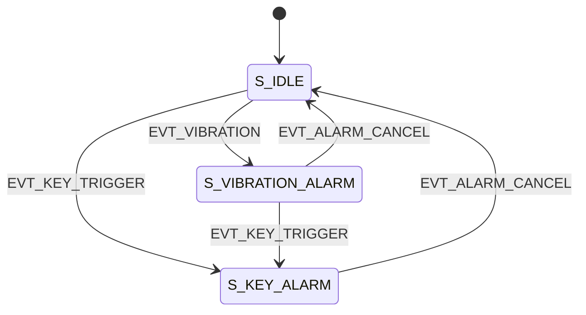

# 状态机清单（草案）

> 基于 `docs/业务流转状态.md` 的业务逻辑流转，整理为"状态/事件/守卫/动作"清单。
> 目标：为后续决定是否引入 XState 或自研状态机提供可讨论的结构化参考。

## 1. 领域信号映射

### 柜体输入（Cabinet Input）
- CI0: 申请按钮 (APPLY_INDEX: 0)
- CI1: 柜门状态 (CABINET_DOOR_INDEX: 1)
- CI2: 门锁开关 (DOOR_LOCK_SWITCH_INDEX: 2)
- CI3: 钥匙开关 (KEY_SWITCH_INDEX: 3)
- CI4: 振动开关 (VIBRATION_SWITCH_INDEX: 4)

### 控制端输入（Control Input）
- CTI8: 报警取消 (ALARM_CANCEL_INDEX: 8)
- CTI9: 授权取消 (AUTH_CANCEL_INDEX: 9)
- CTI10: 授权通过 (AUTH_PASS_INDEX: 10)

### 柜体输出（Cabinet Output）
- CO0: 申请灯 (APPLY_LIGHT_INDEX: 0)
- CO2: 电磁锁 (DOOR_LOCK_SWITCH_INDEX: 2)
- CO3: 门锁开关状态灯 (DOOR_LOCK_SWITCH_LIGHT_INDEX: 3)
- CO4: 柜体报警器 (ALARM_LIGHT_INDEX: 4)

### 控制端输出（Control Output）
- CTO1: 操作台报警器 (RELAY_CONTROL_ALARM_INDEX: 1)

## 2. 关键事件（Event）

### 柜体硬件事件
- EVT_APPLY_ON: 申请按钮按下 (CI0=close)
- EVT_APPLY_OFF: 申请按钮释放 (CI0=open)
- EVT_DOOR_OPEN: 柜门打开 (CI1=open)
- EVT_DOOR_CLOSE: 柜门关闭 (CI1=close)
- EVT_LOCK_OPEN: 门锁打开 (CI2=open)
- EVT_LOCK_CLOSE: 门锁关闭 (CI2=close)
- EVT_KEY_TRIGGER: 钥匙开关触发 (CI3=close)
- EVT_KEY_RESET: 钥匙开关复位 (CI3=open)
- EVT_VIBRATION: 振动触发 (CI4=close)

### 控制端硬件事件
- EVT_ALARM_CANCEL: 取消报警按钮按下 (CTI8=close)
- EVT_AUTH_CANCEL: 授权取消按钮按下 (CTI9=close)
- EVT_AUTH_PASS: 授权通过按钮按下 (CTI10=close)

### 系统事件（超时/监控）
- EVT_TIMEOUT_AUTH: 授权等待超时（触发重试语音播报）
- EVT_TIMEOUT_DOOR_OPEN: 长期开门未关超时 (DOOR_OPEN_TIMEOUT_S)
- EVT_HEARTBEAT_LOST: 心跳异常/设备离线
- EVT_NETWORK_LOST: 网络断连
- EVT_RECOVER: 监控恢复（心跳/网络恢复）

## 3. 状态划分（State）

### A 线：正常业务流（主流程）
- S_IDLE: 初始化/待机
- S_APPLYING: 已申请，等待授权
- S_AUTHORIZED: 授权通过，已开锁（电磁锁打开）
- S_LOCK_OPEN: 门锁拧开（等待开门）
- S_DOOR_OPEN: 柜门已打开，供弹中
- S_WAITING_LOCK_RESET: 柜门已关闭，等待门锁拧回
- S_FINISHED: 供弹完毕（门锁拧回后自动进入，然后归一到 S_IDLE）

### 异常/强制干预流程
- S_KEY_ALARM: 钥匙开门报警中
- S_VIBRATION_ALARM: 振动报警中
- S_MONITOR_ALARM: 设备/网络/心跳/长期开门未关报警中

### 并行监控（建议为并行状态）
- P_MONITORING: 后台监控（心跳/网络/开门超时）

## 4. 守卫条件（Guard）
- G_APPLY_ON: CI0=close（申请按钮按下）
- G_APPLY_OFF: CI0=open（申请按钮释放）
- G_DOOR_OPEN: CI1=open（柜门打开）
- G_DOOR_CLOSE: CI1=close（柜门关闭）
- G_LOCK_OPEN: CI2=open（门锁打开）
- G_LOCK_CLOSE: CI2=close（门锁关闭）
- G_KEY_TRIGGER: CI3=close（钥匙开关触发）
- G_KEY_RESET: CI3=open（钥匙开关复位）
- G_VIBRATION: CI4=close（振动触发）

## 5. 动作（Action）

### 柜体输出控制
- ACT_APPLY_LIGHT_ON: CO0=on（申请灯亮）
- ACT_APPLY_LIGHT_OFF: CO0=off（申请灯灭）
- ACT_UNLOCK: CO2=on（电磁锁开锁）
- ACT_LOCK: CO2=off（电磁锁闭锁）
- ACT_LOCK_SWITCH_LIGHT_ON: CO3=on（门锁开关状态灯亮）
- ACT_LOCK_SWITCH_LIGHT_OFF: CO3=off（门锁开关状态灯灭）
- ACT_CABINET_ALARM_ON: CO4=on（柜体报警器开）
- ACT_CABINET_ALARM_OFF: CO4=off（柜体报警器关）

### 控制端输出控制
- ACT_CONTROL_ALARM_ON: CTO1=on（操作台报警器开）
- ACT_CONTROL_ALARM_OFF: CTO1=off（操作台报警器关）

### 语音/提示

#### 申请供弹
- ACT_VOICE_APPLY_CONTROL: "申请供弹请授权"（控制端）
- ACT_VOICE_APPLY_CABINET: "已申请，请等待授权"（柜体端）
- ACT_VOICE_APPLY_RETRY_CONTROL: "申请供弹等待中，请授权"（控制端重试）
- ACT_VOICE_APPLY_RETRY_CABINET: "等待授权中"（柜体端重试）

#### 授权通过
- ACT_VOICE_AUTH_PASS_CABINET: "授权通过，已开锁，请拧开门锁开关"（柜体端）
- ACT_VOICE_AUTH_PASS_CONTROL: "授权通过，已开锁"（控制端）

#### 门锁拧开
- ACT_VOICE_LOCK_OPEN_CABINET: "门锁已拧开，请打开柜门"（柜体端）
- ACT_VOICE_LOCK_OPEN_CONTROL: "门锁已拧开"（控制端）

#### 柜门打开
- ACT_VOICE_DOOR_OPEN_CONTROL: "柜门已打开"（控制端）
- ACT_VOICE_DOOR_OPEN_CABINET: "已开门，请供弹，供弹后关闭柜门并拧回门锁开关"（柜体端）

#### 柜门关闭
- ACT_VOICE_DOOR_CLOSE_CABINET: "柜门已关闭，请拧回门锁开关"（柜体端）
- ACT_VOICE_DOOR_CLOSE_CONTROL: "柜门已关闭"（控制端）

#### 供弹完毕
- ACT_VOICE_FINISH: "供弹完毕"（柜体端 + 控制端）

#### 授权取消
- ACT_VOICE_AUTH_CANCEL: "授权未通过，供弹结束"（柜体端 + 控制端）

#### 钥匙开门报警
- ACT_VOICE_KEY_ALARM: "钥匙开门请核实"（柜体端 + 控制端）

#### 钥匙复位
- ACT_VOICE_KEY_RESET: "钥匙已复位，请取消报警"（柜体端 + 控制端）

#### 取消报警
- ACT_VOICE_ALARM_CANCEL: "取消报警"（柜体端 + 控制端）

#### 柜体振动报警
- ACT_VOICE_VIB_ALARM: "柜体震动报警"（柜体端 + 控制端）

#### 设备状态异常
- ACT_VOICE_MONITOR_ALARM: "设备状态异常"（控制端）

## 6. 迁移关系（简版）

### 授权通过流程
```
柜体端用户申请 -> 控制端【授权申请灯】亮
                 + 控制端播报【申请供弹请授权】
                 + 柜体端播报【已申请，请等待授权】

控制端用户同意授权 -> 柜体端【电磁锁】开锁
                     + 柜体端播报【授权通过，已开锁，请拧开门锁开关】
                     + 控制端播报【授权通过，已开锁】

柜体端用户拧开门锁开关 -> 控制端【门锁开关状态灯】亮
                        + 柜体端播报【门锁已拧开，请打开柜门】
                        + 控制端播报【门锁已拧开】

柜体端打开柜门 -> 控制端播报【柜门已打开】
                 + 柜体端播报【已开门，请供弹，供弹后关闭柜门并拧回门锁开关】

柜体端用户供弹结束关闭柜门 -> 柜体端播报【柜门已关闭，请拧回门锁开关】
                            + 控制端播报【柜门已关闭】

柜体端用户拧回门锁开关 -> 控制端【门锁开关状态灯】灭
                         + 控制端【授权申请灯】灭
                         + 柜体端【电磁锁】落锁
                         + 控制端播报【供弹完毕】
                         + 柜体端播报【供弹完毕】
```

**状态迁移：**
- S_IDLE --EVT_APPLY_ON--> S_APPLYING / ACT_APPLY_LIGHT_ON + ACT_VOICE_APPLY_CONTROL + ACT_VOICE_APPLY_CABINET
- S_APPLYING --EVT_AUTH_PASS--> S_AUTHORIZED / ACT_UNLOCK + ACT_VOICE_AUTH_PASS_CABINET + ACT_VOICE_AUTH_PASS_CONTROL
- S_AUTHORIZED --EVT_LOCK_OPEN--> S_LOCK_OPEN / ACT_LOCK_SWITCH_LIGHT_ON + ACT_VOICE_LOCK_OPEN_CABINET + ACT_VOICE_LOCK_OPEN_CONTROL
- S_LOCK_OPEN --EVT_DOOR_OPEN--> S_DOOR_OPEN / ACT_VOICE_DOOR_OPEN_CONTROL + ACT_VOICE_DOOR_OPEN_CABINET
- S_DOOR_OPEN --EVT_DOOR_CLOSE--> S_WAITING_LOCK_RESET / ACT_VOICE_DOOR_CLOSE_CABINET + ACT_VOICE_DOOR_CLOSE_CONTROL
- S_WAITING_LOCK_RESET --EVT_LOCK_CLOSE--> S_FINISHED / ACT_LOCK_SWITCH_LIGHT_OFF + ACT_APPLY_LIGHT_OFF + ACT_LOCK + ACT_VOICE_FINISH
- S_FINISHED --(auto)--> S_IDLE

### 授权等待超时重试机制

**超时配置：**
- `AUTH_RETRY_INTERVAL_S`: 授权重试间隔（建议 30 秒）

**状态迁移（超时重试）：**
```
S_APPLYING --EVT_TIMEOUT_AUTH--> S_APPLYING / ACT_VOICE_APPLY_RETRY_CONTROL + ACT_VOICE_APPLY_RETRY_CABINET
```

**流程说明：**
```
用户申请供弹 -> 进入 S_APPLYING 状态
    |
    |---> 等待授权...
    |     |
    |     |---> 超过 AUTH_RETRY_INTERVAL_S (30秒) 未响应
    |     |     -> 触发 EVT_TIMEOUT_AUTH
    |     |     -> 保持 S_APPLYING 状态
    |     |     -> 播报重试语音：控制端"申请供弹等待中，请授权"，柜体端"等待授权中"
    |     |     -> 继续等待授权
    |     |
    |     |---> 再次超过 AUTH_RETRY_INTERVAL_S (30秒) 未响应
    |     |     -> 再次触发 EVT_TIMEOUT_AUTH
    |     |     -> 再次播报重试语音
    |     |     -> 继续等待授权
    |     |
    |     |---> （无限循环重试，直至控制端操作授权通过/授权取消）
```

**优先级处理：**
- 授权等待期间，控制端的授权通过/授权取消操作优先于超时事件
- 一旦用户操作授权按钮，立即清除超时计时器
- 超时重试不应打断用户正在进行的操作

### 授权不通过流程
```
柜体端用户申请 -> 控制端【授权申请灯】亮
                 + 控制端播报【申请供弹请授权】
                 + 柜体端播报【已申请，请等待授权】

控制端用户拒绝授权 -> 柜体端播报【授权未通过，供弹结束】
                     + 控制端播报【授权未通过，供弹结束】
                     + 控制端【授权申请灯】灭
```

**状态迁移：**
- S_APPLYING --EVT_AUTH_CANCEL--> S_IDLE / ACT_APPLY_LIGHT_OFF + ACT_VOICE_AUTH_CANCEL

### 钥匙开门报警
- S_IDLE --EVT_KEY_TRIGGER--> S_KEY_ALARM / ACT_CABINET_ALARM_ON + ACT_CONTROL_ALARM_ON + ACT_VOICE_KEY_ALARM (注：供弹流程中不响应此报警)
- S_KEY_ALARM --EVT_KEY_RESET--> S_KEY_ALARM / ACT_VOICE_KEY_RESET（保持报警，等待取消）
- S_KEY_ALARM --EVT_ALARM_CANCEL--> S_IDLE / ACT_CABINET_ALARM_OFF + ACT_CONTROL_ALARM_OFF + ACT_VOICE_ALARM_CANCEL

### 振动报警
- S_IDLE --EVT_VIBRATION--> S_VIBRATION_ALARM / ACT_CABINET_ALARM_ON + ACT_CONTROL_ALARM_ON + ACT_VOICE_VIB_ALARM (注：供弹流程中不响应此报警)
- S_VIBRATION_ALARM --EVT_ALARM_CANCEL--> S_IDLE / ACT_CABINET_ALARM_OFF + ACT_CONTROL_ALARM_OFF + ACT_VOICE_ALARM_CANCEL

### 监控报警（并行）
- P_MONITORING --EVT_HEARTBEAT_LOST--> S_MONITOR_ALARM / ACT_CONTROL_ALARM_ON + ACT_VOICE_MONITOR_ALARM
- P_MONITORING --EVT_NETWORK_LOST--> S_MONITOR_ALARM / ACT_CONTROL_ALARM_ON + ACT_VOICE_MONITOR_ALARM
- P_MONITORING --EVT_TIMEOUT_DOOR_OPEN--> S_MONITOR_ALARM / ACT_CONTROL_ALARM_ON + ACT_VOICE_MONITOR_ALARM
- S_MONITOR_ALARM --EVT_ALARM_CANCEL--> S_IDLE / ACT_CONTROL_ALARM_OFF + ACT_VOICE_ALARM_CANCEL (注：若是柜门超时未关报警，禁止使用取消按钮，必须关门)
- S_MONITOR_ALARM --EVT_RECOVER--> S_IDLE / ACT_CONTROL_ALARM_OFF

## 7. 并行/优先级建议

- 主流程与 P_MONITORING 并行。
- 任何报警类状态可视为"高优先级"，进入后暂停主流程动作，或要求显式解除后继续。
- 如果多个报警同时触发，建议统一进入一个"ALARM_ACTIVE"并记录来源列表。

## 8. XState 适配建议（简述）

- 用 `parallel` 定义主流程与监控流程。
- 用 `after` 处理超时（授权等待重试/开门超时）。
  - `S_APPLYING` 状态使用循环 `after` 实现无限重复语音播报
  - 示例：`after: { 30000: { target: 'S_APPLYING', actions: 'broadcastRetry' } }`
  - 自循环状态迁移确保无限重试，直至外部事件中断
- 用 `invoke` 或 `services` 处理心跳/网络检测。
- 动作层统一封装为"硬件输出 + 语音播报"。

## 9. 警报状态机设计

### 设计原则

| 原则 | 说明 |
|-----|------|
| **阻塞主流程** | 任何警报触发后，主流程暂停，无法继续操作 |
| **硬重置** | 警报解除后强制回到 `S_IDLE`，需重新申请 |
| **优先级处理** | 钥匙报警 > 振动报警 |
| **统一解除入口** | 控制端【取消报警】按钮 (`ALARM_CANCEL_INDEX`) |

### 警报类型与优先级

| 警报类型 | 优先级 | 触发事件 | 解除条件 |
|---------|--------|---------|---------|
| S_KEY_ALARM | 1 (最高) | EVT_KEY_TRIGGER (CI3=close) | EVT_ALARM_CANCEL |
| S_VIBRATION_ALARM | 2 | EVT_VIBRATION (CI4=open) | EVT_ALARM_CANCEL |

### 钥匙报警状态 (S_KEY_ALARM)

```
触发条件: EVT_KEY_TRIGGER (CI3 从 open 变为 close)
解除条件: EVT_ALARM_CANCEL (CTI8=close)

入口动作:
  - ACT_CABINET_ALARM_ON (CO4=on，柜体报警器开)
  - ACT_CONTROL_ALARM_ON (CTO1=on，控制台报警器开)
  - ACT_VOICE_KEY_ALARM (播报"钥匙开门请核实")

内部事件:
  - EVT_KEY_RESET → ACT_VOICE_KEY_RESET (播报"钥匙已复位，请取消报警")
  - EVT_VIBRATION → 忽略（已在更高优先级报警中）

出口动作:
  - ACT_CABINET_ALARM_OFF (CO4=off)
  - ACT_CONTROL_ALARM_OFF (CTO1=off)
  - ACT_VOICE_ALARM_CANCEL (播报"取消报警")
  - 通知主状态机: alarm_cancelled
```

### 振动报警状态 (S_VIBRATION_ALARM)

```
触发条件: EVT_VIBRATION (CI4 从默认 close 变为 open)
解除条件: EVT_ALARM_CANCEL (CTI8=close)

入口动作:
  - ACT_CABINET_ALARM_ON (CO4=on)
  - ACT_CONTROL_ALARM_ON (CTO1=on)
  - ACT_VOICE_VIB_ALARM (播报"柜体震动报警")

被抢占:
  - EVT_KEY_TRIGGER → 转入 S_KEY_ALARM (更高优先级抢占)

出口动作:
  - ACT_CABINET_ALARM_OFF
  - ACT_CONTROL_ALARM_OFF
  - ACT_VOICE_ALARM_CANCEL
  - 通知主状态机: alarm_cancelled
```

### 警报状态迁移图



### 主状态机与警报状态机交互

```
主状态机 (main-machine):
  - 收到 key_detected 事件 → 转入 alarm 状态，调用 alarm-machine
  - 收到 vibration_detected 事件 → 转入 alarm 状态，调用 alarm-machine
  - 收到 alarm_cancelled 事件 → 返回 idle 状态

警报状态机 (alarm-machine):
  - 收到 KEY_DETECTED → 进入 key_alarm 状态
  - 收到 VIBRATION_DETECTED → 进入 vibration_alarm 状态
  - 收到 ALARM_CANCEL → 执行出口动作，发送 alarm_cancelled 给父状态机
```
